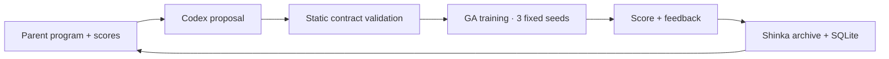
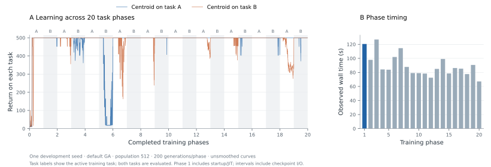
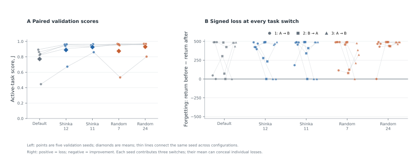
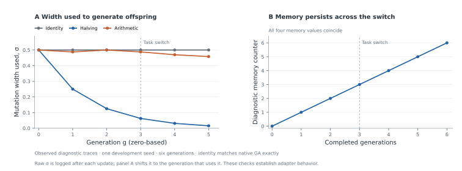
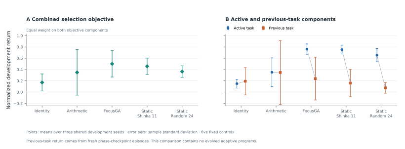
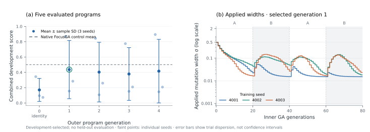
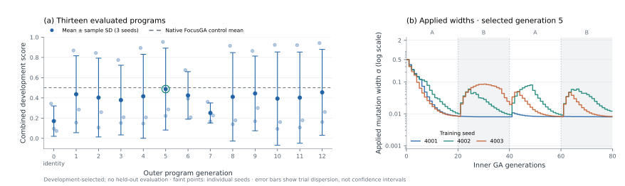
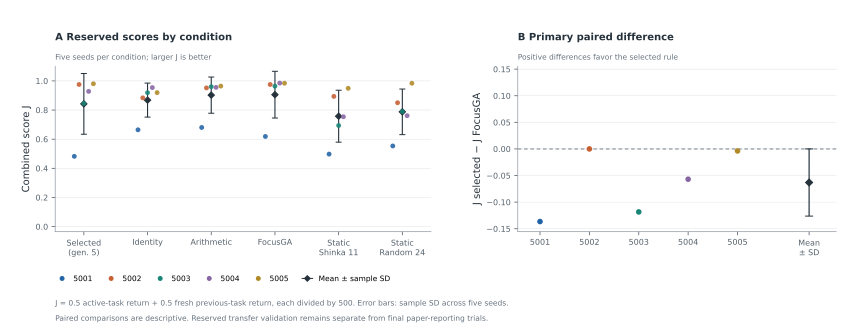

<div align="center">

# Shinka Continual Reinforcement Learning

**Reproducing continual neuroevolution · Searching with ShinkaEvolve**

[Reference paper](https://arxiv.org/abs/2610.01583v1) · [Experimental roadmap](docs/experimental-roadmap.md) · [Shinka task](tasks/cartpole_ga/README.md) · [Source pins](upstream.lock.json)

<sub>A living research report · CartPole study · October 2026</sub>

</div>

---

## Abstract

This project pursues a controlled reproduction of *Continual Reinforcement Learning with Neuroevolution* by Nisioti, Cossu, Korte, and Risi (2026), with ShinkaEvolve as a separately evaluated extension. We preserve the pinned GA, ES, and PPO implementations, beginning with CartPole under alternating observation offsets. An 18-trial CPU pilot passed the predefined stationary-learning gate for all three methods. Static search evaluated 25 Shinka programs and 24 random controls: 147 seed trials and 1.129 billion nominal training steps. Shinka produced 17 distinct mutations and seven repeated evaluations. A reserved five-seed comparison selected Shinka program 11 and random control 24, with active-return scores of 0.9268 and 0.9306 versus 0.7720 for the default. Their mean forgetting was higher than the default's, so better active return did not establish better retention. One paper-budget GA development trial completed all 20 phases in 30.4 minutes including analysis. A restricted adaptive mutation adapter passes seven real diagnostic trials, including exact identity with native GA across a task switch and persistent program memory. Its frozen active/previous-task evaluator completed 15 fixed-control trials on fresh development seeds. Adaptive Shinka search completed its declared 25-slot allocation with 21 valid programs, retaining three grammar failures and an interrupted request. The best proposed rule scores 0.4871, above identity GA's 0.1706 but below native FocusGA's 0.5006, with substantial seed variation. In the frozen five-seed adaptive validation, the selected rule scored 0.8423 versus 0.9054 for FocusGA, with paired difference −0.0631 ± 0.0632 (mean ± sample SD). All 30 trials completed; the primary comparison does not support an advantage for the selected rule. These results establish an executable research pipeline and controlled comparisons; they do not establish search-method superiority or a full-paper reproduction.

> **Study status:** Baseline pilot and 25/24 static-search endpoint complete · Full-budget GA development reference complete · Static finalist validation complete · Adaptive controls and complete 25-slot Shinka endpoint reviewed · 21 valid programs with all failures retained · Reserved adaptive validation complete: 30 trials; selected rule below FocusGA · Full reproduction pending.

## 1. Research questions

1. Can the pinned reference implementation reproduce the reported continual-learning behavior on the two-task CartPole experiment?
2. Does a ShinkaEvolve-selected GA configuration improve held-out performance relative to the original GA and a search-budget-matched random-search control?
3. Can ShinkaEvolve discover executable adaptive mutation rules that improve learning and retention relative to static tuning and the reference's existing adaptive mechanism?

The first extension searches mutation scale `sigma` and archive fraction `elite_ratio`. This is LLM-guided hyperparameter optimization and supplies a baseline for the main extension: adaptive learning rules. It cannot discover new selection or memory mechanisms through the current two-number interface.

## 2. Experimental design

**Task.** The reference cell is `CartPole-v1_sigma0.5`: the original environment alternates with a fixed observation offset. Training receives no explicit task-boundary signal. We preserve the upstream policy architecture, task construction, environment dynamics, and centroid evaluation.

**Full comparison.** Ten trials use seeds 42–51 and task trials 1–10. Each learner has the same nominal training environment-step budget; evaluation and diagnostics are accounted for separately.

| Protocol component | GA | ES | PPO |
| :--- | ---: | ---: | ---: |
| Distinct tasks / phases | 2 / 20 | 2 / 20 | 2 / 20 |
| Generations or updates per phase | 200 | 200 | 1,500 |
| Total generations or updates | 4,000 | 4,000 | 30,000 |
| Population or parallel environments | 512 | 512 | 2,048 |
| Training episodes per candidate | 3 | 3 | — |
| Rollout steps per PPO update | — | — | 50 |
| Episode cap | 500 | 500 | 500 |
| Evaluation episodes per checkpoint | 10 | 10 | 10 |
| Nominal training steps per trial | 3.072 × 10⁹ | 3.072 × 10⁹ | 3.072 × 10⁹ |

<sub>Table 1. Planned full CartPole protocol. GA uses `sigma=0.5`, `elite_ratio=0.5`; ES uses `sigma=0.1`, learning rate `0.05`, SGD, and z-score fitness. PPO retains the upstream paper hyperparameters.</sub>

The `paper-cartpole` profile explicitly requests **20 phases**. The upstream YAML default is 10; running that default does not reproduce this protocol. See the [reproduction plan](docs/reproduction-plan.md) for source links and the separate ten-distinct-task experiment.

**Development and reporting separation.** The profiles below are fixed outside the candidate program. Development task trials use `trial=seed+1`, keeping both seeds and observation-offset draws separate from the reporting trials.

| Profile | Role | Seeds | Phases | Training budget |
| :--- | :--- | :--- | ---: | :--- |
| `smoke` | Validate execution and artifacts | 1001 | 2 | 4 generations/updates; episode cap 32 |
| `search` | Select GA configurations | 1001–1003 | 4 | 80 generations × 64 candidates × 3 episodes |
| `pilot-stationary` / `pilot-switching` | Matched baseline development comparison | 1001–1003 | 4 | 7.68 × 10⁶ nominal steps per learner and trial |
| `cartpole-validation` | One frozen finalist comparison | 2001–2005 | 4 | 320 generations × 64 candidates × 3 episodes |
| `paper-cartpole-timing` | Default-GA development reference | 1001 | 20 | 3.072 × 10⁹ nominal steps; final seeds excluded |
| `paper-cartpole` | Final reporting | 42–51 | 20 | Full protocol in Table 1 |

<sub>Table 2. Experiment profiles. Smoke budgets are intentionally small and are not compute-matched across methods.</sub>

**Pilot measurements.** GA and ES are reported through their saved centroids;
PPO through its saved policy. Ten fresh greedy evaluation episodes per checkpoint
measure learning accuracy (LA), consecutive-switch forgetting (F), and zero-shot
transfer (ZT). Both switching directions enter forgetting, and negative values
are retained. Stationary transfer metrics are left undefined. Post-hoc evaluation
preserves the reference's method-specific random-key derivation; a shared base
evaluation seed does not imply identical episodes across methods.

Cumulative return follows the reference's completed-update clock and unit
NE-generation resampling grid before trapezoidal integration. The evidence also
retains an integral over every logged sample, because the two conventions can
differ for PPO. The first observed return is held back to step zero; it is not a
measurement of an untrained policy. Raw reward units and fixed `/500`
normalization remain distinct from the paper's reference-based rescaling.

## 3. ShinkaEvolve extension

[ShinkaEvolve](https://sakanaai.github.io/ShinkaEvolve/) proposes candidate programs through LLM-guided mutation and evolutionary search. In this study, each candidate supplies a literal `get_ga_config()` dictionary to the unchanged upstream GA.

| Search variable | Admissible range | Initial configuration |
| :--- | ---: | ---: |
| Mutation scale, `sigma` | [0.001, 2.0] | 0.5 |
| Archive fraction, `elite_ratio` | [0.05, 0.95] | 0.5 |

<sub>Table 3. Initial search space. The evaluator parses candidate syntax without importing or executing the submitted program.</sub>

Population size, task schedule, episode cap, seeds, and scoring are fixed by the harness. A candidate's development score is its active-task centroid return, averaged across training checkpoints and development seeds, divided by the episode cap:

$$
J(\theta) = \frac{1}{|S|} \sum_{s \in S}
\frac{1}{T H} \sum_{t=1}^{T} R^{\mathrm{centroid}}_{s,t,a(t)}(\theta).
$$

Here, $a(t)$ is the active task, $H$ the episode cap, and $T$ the number of recorded generations. Larger scores are better. This objective selects configurations; final reporting additionally requires the paper's learning accuracy, forgetting, cumulative return, and zero-shot transfer metrics with uncertainty across trials. The selected configuration must be frozen before reporting trials.

The complete initial candidate is:

```python
# EVOLVE-BLOCK-START
def get_ga_config():
    return {"sigma": 0.5, "elite_ratio": 0.5}
# EVOLVE-BLOCK-END
```

There are two distinct evolutionary loops. Shinka selects a parent program from its archive and asks Codex to propose a code mutation. The fixed evaluator then trains a fresh population of policy networks for each development seed. One outer candidate therefore requires **three trials × 80 inner GA generations**, or 23.04 million nominal training steps. Policy weights are not inherited between candidate evaluations.



The completed first search had one initial candidate and **24 proposal slots**, compared with a matched random-search control. Shinka's total generation targets were **5 → 13 → 25**; each completed block resumed from the same result directory. These counted attempts, not distinct valid programs. A higher active-task score alone is not evidence of reduced forgetting.

The implemented adaptive interface, `update_sigma(sigma, stats, memory)`,
executes after each GA update and controls the next generation's mutation width.
Its five training-only statistics and four persistent memory values permit
behavior that changes during learning, without a task-boundary signal. The
[adaptive protocol](docs/experimental-roadmap.md#7-second-search-space-adaptive-mutation-programs)
specifies a neutral identity rule, a fixed arithmetic adaptation rule, both static
search winners, and the upstream `ga_focus` as controls. The latter also adapts
parent selection and preserves fixed-width explorers; it is a whole-method
comparison. It remains separate from the paper's plain-GA CartPole baseline.
The new interface preserves the baseline's selection, policy, random stream,
and training budget. Adaptive Shinka proposal results are reported below.
The [implementation specification](docs/adaptive-programs.md) defines the exact
trainer hook, executable grammar, memory, width timing, and focused checks.
Its frozen objective combines active return with performance on the previous
task after a switch; the paper's learning and forgetting metrics remain separate.
The [adaptive evaluator and cache](docs/adaptive-evaluation.md) use fresh
development seeds 4001–4003 and reserve 5001–5005 for later validation. Repeated
canonical programs reuse only verified complete evidence and still consume
their outer proposal slots.

## 4. Results

### Pipeline validation

Real training, metric validation, and the Shinka evaluator contract all completed successfully on CPU. The validation used seed 1001, task trial 1002, four generations or updates, and an episode cap of 32. Python 3.11.15 and JAX 0.5.3 ran on two logical CPUs; the sequential suite took 56.23 seconds, including startup and compilation.

| Run | Valid metric rows | Mean active-task return | Normalized score | Wall time (s) | Status |
| :--- | ---: | ---: | ---: | ---: | :--- |
| GA baseline | 4 | 10.00 | 0.312500 | 20.77 | Pass |
| ES baseline | 4 | 12.50 | 0.390625 | 11.61 | Pass |
| PPO baseline | 4 | 23.50 | 0.734375 | 8.13 | Pass |
| Initial Shinka candidate | 4 | 10.00 | 0.312500 | 14.67 | Pass |

<sub>Table 4. Observed smoke results, 2 October 2026. Returns average active-task centroid evaluations across four checkpoints. Wall times include trainer startup and compilation. These values validate execution; unequal budgets and one seed preclude a scientific comparison.</sub>

The initial candidate matches the default GA score and returns `correct: true`, validating the evaluator without model calls. The [evidence archive](reports/smoke-20261002) contains raw metrics, resolved configurations, logs, environment details, and checksums. The first execution exposed a log-file collision; the validated rerun separates harness output (`process.log`) from the upstream training log (`train.log`). The first attempt is retained locally.

### Development runtime calibration

The unchanged initial candidate also completed the full `search` profile: 80 generations per seed, four alternating phases, population 64, three training and evaluation episodes, and a 500-step cap. The three sequential trials took **114.69 seconds** including imports, compilation, training, and scoring. Maximum individual child-process resident memory was 722 MiB; this is not aggregate system memory.

| Development seed | Task trial | Generations | Wall time (s) |
| :--- | ---: | ---: | ---: |
| 1001 | 1002 | 80 | 43.82 |
| 1002 | 1003 | 80 | 28.46 |
| 1003 | 1004 | 80 | 42.03 |
| **Complete candidate evaluation** | **3 trials** | **240** | **114.69** |

<sub>Table 5. Measured search evaluation on two logical CPUs, 2 October 2026. The complete duration includes evaluator overhead. This is one configuration's runtime calibration, not an estimate of variation across configurations or an algorithm comparison. [Protocol, raw evidence, and checksums](reports/search-timing-20261002).</sub>

The pre-search projection used this rate to estimate approximately 48 minutes
for 25 candidate evaluations. Assuming an additional 0.5–2 minutes per Codex
proposal gave **60–100 minutes** for Shinka, with approximately 46 minutes for
24 random controls. These historical estimates are superseded by the measured
execution costs and proposal latency in the [configuration-search results](#subscription-backed-configuration-search).
Neither projection estimates full-paper runtime.

The native Shinka loop also passed an independent execution test with a fixed
local response and **zero model requests**. It evaluated generations 0 and 1,
resumed the same SQLite archive, and added generation 2 with verified parentage
0 → 1 → 2. The initial smoke score remained 0.3125. The repeated fixture candidate
demonstrated that duplicate evaluations still consume training work. This tests
transport, evaluation, and resume, rather than proposal quality; all artifacts
are retained in the [native integration evidence](reports/native-integration-20261002/summary.json).

Runtime inspection before the first model proposal found that native Shinka
overrode the outer numerical thread cap with eight threads. The initial search
setup was stopped after two complete seeds and one partial seed, preserving
15.36 million completed nominal steps plus unquantified partial work. No model
request occurred. The corrected job configuration explicitly caps numerical
threads at one in both search arms and records the evaluator's actual runtime.
This setup attempt is excluded from candidate comparisons and retained in the
[interrupted-attempt evidence](reports/search-setup-interrupted-20261002/summary.json).

### Matched development pilot

The pilot completed GA, ES, and PPO under stationary and alternating conditions
on seeds 1001–1003. Every trial used four phases and 7.68 million nominal training
steps; ten fresh episodes evaluated each saved phase checkpoint. Training,
analysis, and verification took **36.08 minutes** on two logical CPUs across two
sessions. Resuming verified and reused the first six trials without retraining.


<sub>Figure 1. Observed active-task centroid returns at matched nominal training steps. Thin lines show individual trials; bold lines show three-seed means, with no smoothing or confidence bands. Shaded phases introduce a fixed observation offset. [Vector PDF](figures/pilot-20261002.pdf) · [Figure provenance](figures/pilot-20261002.json).</sub>

| Condition | Method | LA ↑ | F ↓ | LA − F ↑ | ZT ↑ | Cum. / (steps × 500) ↑ |
| :--- | :--- | ---: | ---: | ---: | ---: | ---: |
| Stationary | GA | 315.2 ± 77.7 | — | — | — | 0.506 ± 0.176 |
| Stationary | ES | 448.4 ± 51.5 | — | — | — | 0.745 ± 0.135 |
| Stationary | PPO | 476.3 ± 41.0 | — | — | — | 0.964 ± 0.002 |
| Switching | GA | 321.0 ± 82.3 | −9.3 ± 62.6 | 330.3 ± 119.1 | 166.2 ± 89.8 | 0.561 ± 0.114 |
| Switching | ES | 407.3 ± 35.5 | 127.8 ± 127.5 | 279.5 ± 147.6 | 137.7 ± 109.0 | 0.604 ± 0.154 |
| Switching | PPO | 481.2 ± 18.0 | 360.0 ± 156.7 | 121.2 ± 140.4 | 104.4 ± 122.6 | 0.908 ± 0.045 |

<sub>Table 6. Observed development metrics, mean ± sample standard deviation across three trials. LA, F, LA − F, and ZT use raw CartPole reward units; the final column is the reference-grid cumulative integral divided by nominal training steps and episode cap. It is not the paper's reference-based rescaling. Stationary transfer metrics are undefined. LA averages all four phase endpoints, so it can be lower than final-phase performance. [Complete evidence and per-trial values](reports/pilot-20261002/summary.json).</sub>

All three methods passed the predefined adequacy gate: every stationary trial
finished with last-phase mean return above 400. GA and ES also improved by at
least 50 points between their first and last phases in all three trials. PPO
learned early and passed through the final-performance criterion. This supports
using the reduced budget for development; it is not a significance test.

Under switching, PPO has the highest observed learning accuracy and cumulative
return, alongside the largest measured forgetting. GA's lower forgetting
coincides with lower learning accuracy, illustrating why retention alone is
insufficient. The negative GA forgetting estimate is preserved rather than
clamped. For example, switching GA seed 1002 improves on task A from 158.6 to
500.0 after its first switch, then loses 135.4 and 141.5 reward points on the
previous task at the next two switches. Its mean forgetting is therefore −21.5,
despite those later losses ([individual switch measurements](reports/pilot-20261002/raw/trials/pilot-switching/ga/seed_1002/analysis/attempt_001/summary.json)).
With only three trials, four phases, and reduced populations, these
outcomes do not establish a general method ranking or reproduce the full study.
The [evidence archive](reports/pilot-20261002) includes resolved configurations,
raw trajectories and episode returns, source/runtime provenance, artifact
checksums, and the complete gate decision. Binary checkpoints remain local.

### Subscription-backed configuration search

The declared static-search endpoint completed **25 Shinka programs, including
the shared default, and 24 random controls**. Every evaluation used three
development seeds, four phases, and 23.04 million nominal training steps.
All evaluations passed. The 24 Shinka proposals yielded **17 distinct mutations
and 7 duplicate evaluations**; repeated training remains charged.


<sub>Figure 2. A: the declared primary comparison matches distinct configurations, using the first 17 frozen random controls; it does not equalize actual training work. B: all 24 additional evaluations per arm, including repeated Shinka configurations. Both panels share the default at zero. Steps show the best observed score and faint markers retain individual outcomes. [PDF](figures/search-endpoint-20261002.pdf) · [Exact values and hashes](figures/search-endpoint-20261002.json).</sub>

| Configuration | Mutation width, σ | Archive fraction | Elites / 64 | Development score, J ↑ |
| :--- | ---: | ---: | ---: | ---: |
| Shared default | 0.500000 | 0.500000 | 32 | 0.5654 ± 0.1168 |
| Best Shinka · program 12 | 0.080000 | 0.075000 | 4 | 0.8721 ± 0.0578 |
| Best random · first 17 controls | 0.330187 | 0.062208 | 3 | 0.8857 ± 0.0275 |
| Best random · all 24 controls | 0.330187 | 0.062208 | 3 | 0.8857 ± 0.0275 |

<sub>Table 7. Selected development maxima, 2 October 2026. J averages active-task centroid return divided by 500 across 80 checkpoints and three seeds; entries show mean ± sample standard deviation across seeds. The first-17 prefix is the declared matched-distinct comparison. All 24 controls form the secondary comparison with equal numbers of additional candidate evaluations, sharing the default. Parameters are rounded; [all 49 evaluations and per-seed results](reports/search-endpoint-20261002/summary.json) retain exact values.</sub>

Random search has the higher observed maximum in the matched prefix and the
full control pool. The Shinka incumbent did not improve beyond the
[13-program checkpoint](reports/search-stage13-20261002/summary.json).
These are selected development outcomes from one search per arm; they do not
establish search-method superiority, retention, or held-out improvement.
Both arms' top two distinct configurations and the default are retained for
one reserved validation comparison.

Repeated proposals are an observed limitation of this run. For example,
[program 20's prompt](reports/search-endpoint-20261002/raw/shinka/gen_20/attempts/novelty_1/resample_1/patch_1/headless_prompt.md)
includes selected high-scoring examples but omits earlier lower-scoring
evaluations of its repeated setting. Its response extrapolates from those
examples and proposes the setting again. Incomplete sampled context is a
plausible mechanism; this inspection does not establish sole causality.
The frozen proposer and retraining policy were preserved throughout.

| Observed cumulative cost | Shinka, including default | Additional random control | Total |
| :--- | ---: | ---: | ---: |
| Configuration evaluations | 25 | 24 | 49 |
| Completed seed trials | 75 | 72 | 147 |
| Nominal training steps | 576.00 × 10⁶ | 552.96 × 10⁶ | 1,128.96 × 10⁶ |
| Execution time (min) | 59.77 | 42.06 | 101.84 |
| Successful Codex responses | 24 | 0 | 24 |

<sub>Table 8. Actual execution costs through the declared endpoint, including all duplicate evaluations and counting the shared default once. Wall time sums completed sessions, including startup, proposals, training, evaluation, and checkpoint handling. Setup, preflight, review pauses, and the separately archived interrupted setup attempt are excluded.</sub>

All 24 proposals used GPT-6.1 Sol at medium effort through guarded local ChatGPT
authentication, without an API-key route. Response times ranged from
13.5 to 23.1 seconds. Native usage records report 154,065 uncached input
tokens and 3,967 output tokens; cached input, reasoning/tool counts, and remaining
subscription allowance are unavailable. Shinka's dollar estimates are API-price
equivalents, not billing receipts. The [endpoint evidence](reports/search-endpoint-20261002)
retains prompts, responses, exact programs, ancestry, raw trajectories,
runtime receipts, usage records, and hashes. All scores were independently
reconstructed. The [five-program](reports/search-integration-20261002/summary.json)
and [13-program](reports/search-stage13-20261002/summary.json) checkpoints remain
available.

The static search is closed. The full-budget development reference and reserved
finalist validation are complete. Validation feedback will not be used for
further proposals from this archive.

### Paper-budget development reference

One unchanged default-GA trial completed all **20 phases and 4,000 generations**
with population 512: **3.072 billion nominal training steps**. It used development
seed 1001 / task trial 1002, separate from final reporting. Ten fresh episodes
per saved phase checkpoint supplied the continual-learning measurements.



<sub>Figure 3. One paper-budget development trial. The centroid is evaluated on both tasks throughout training; A/B labels mark the active task. Curves are unsmoothed and use different episode draws from Table 9's fresh checkpoint analysis. Timing includes in-loop evaluation and checkpoint I/O; phase one additionally includes startup and JIT compilation. [PDF](figures/reference-timing-20261002.pdf) · [Exact curves, all 19 switch differences, and provenance](figures/reference-timing-20261002.json).</sub>

| Measurement | Observed value |
| :--- | ---: |
| Training process time | 30.20 min |
| Total runner time, including fresh checkpoint analysis | 30.41 min |
| First phase, including startup/JIT | 120.48 s |
| Later phases, median [minimum, maximum] | 84.98 [67.17, 126.82] s |
| Peak trainer resident memory | 843.2 MiB |
| Active-return score, J | 0.9915 |
| Learning accuracy, LA | 500.00 |
| Mean signed forgetting, F | 28.39 |
| LA − F | 471.61 |
| Zero-shot transfer, ZT | 463.77 |

<sub>Table 9. One development trial on two logical CPUs with the frozen numerical thread settings. Reward metrics use raw CartPole units. Peak RSS belongs to the training process and excludes separate post-hoc analysis. [Complete evidence, phase timings, and checkpoint returns](reports/reference-timing-20261002/summary.json).</sub>

This establishes that a complete paper-budget GA trial fits this machine. It
does not estimate uncertainty across trials or establish a method ranking.
A linear scheduling estimate for ten sequential GA trials is
**5.1 hours** at this observed speed, excluding
retries, review, and hardware contention. This estimate does not apply to ES or
PPO; their full-budget runtime still needs measurement. The paper-scale
comparison and final-reporting trials remain pending.

### Reserved static-finalist validation

The five candidates frozen at the static endpoint completed their single
reserved comparison on **seeds 2001–2005 and task trials 2002–2006**. Each trial
used four phases of 80 generations, population 64, and ten evaluation episodes.
These new task draws and longer phases differ from development search. No
validation result was fed back to the proposer.
Random finalists were ranked over all 24 frozen controls, as declared; this
validation follows the full-pool comparison, not the 17-control prefix.



<sub>Figure 4. All five reserved validation seeds and every signed switch difference are retained. Positive forgetting denotes lost return; negative values denote improvement. Lines connect measurements from the same seed. [PDF](figures/validation-static-20261002.pdf) · [Exact plotted values and provenance](figures/validation-static-20261002.json).</sub>

| Frozen configuration | Active score, J ↑ | LA ↑ | F ↓ | LA − F ↑ | ZT ↑ | Cum. / (steps × 500) ↑ |
| :--- | ---: | ---: | ---: | ---: | ---: | ---: |
| Default GA | 0.7720 ± 0.1846 | 475.8 ± 45.5 | 312.7 ± 174.3 | 163.1 ± 188.7 | 180.7 ± 232.6 | 0.770 ± 0.185 |
| Shinka 12 | 0.8894 ± 0.1228 | 487.1 ± 28.7 | 340.2 ± 142.8 | 147.0 ± 152.0 | 141.2 ± 154.8 | 0.888 ± 0.123 |
| Shinka 11 | 0.9268 ± 0.0401 | 496.0 ± 9.0 | 353.4 ± 153.8 | 142.6 ± 157.5 | 128.5 ± 141.6 | 0.925 ± 0.040 |
| Random 7 | 0.8751 ± 0.1914 | 457.1 ± 95.8 | 340.3 ± 108.8 | 116.9 ± 134.2 | 118.6 ± 120.2 | 0.874 ± 0.191 |
| Random 24 | 0.9306 ± 0.0716 | 496.2 ± 8.6 | 441.9 ± 65.4 | 54.3 ± 67.6 | 62.6 ± 74.5 | 0.929 ± 0.072 |

<sub>Table 10. Reserved validation, mean ± sample standard deviation across five seeds per configuration. Reward metrics use raw CartPole units. The declared selection criterion is the active-task score over all 320 checkpoints; retention metrics do not choose the winners. The cumulative column uses the reference integration convention. [All trials, switch differences, resolved settings, and costs](reports/validation-static-20261002/summary.json).</sub>

The declared rule selects **Shinka 11** for the Shinka arm
(J = 0.9268) and **Random 24** for the random arm
(J = 0.9306). Exact source hashes and settings are retained
in the report's `selected_winners`; all five outcomes remain visible. These
selected validation scores are not final-reporting estimates or evidence that
one search method is generally superior. No further static proposals will use
this partition.

Both selected configurations have higher mean active return than the default
(0.7720), but also higher mean forgetting: **353.4** for Shinka 11 and **441.9**
for Random 24, versus **312.7** for the default. The selected arms differ by only
0.0037 in active score. These five-seed observations support reporting the
learning–retention trade-off; they do not establish a general ranking. The
single full-budget reference above uses a different seed and budget and is not
a matched comparator for this table.

| Frozen control | Mutation width, σ | Archive fraction | Elites at population 64 / 512 |
| :--- | ---: | ---: | ---: |
| Default GA | 0.500000 | 0.500000 | 32 / 256 |
| Shinka 11 | 0.065000 | 0.075000 | 4 / 38 |
| Random 24 | 0.224195 | 0.092160 | 5 / 47 |

<sub>Table 11. Parameters retained for subsequent comparisons. Archive counts follow the unchanged integer conversion; population-512 counts are derived, not additional experiments. Displayed parameters are rounded; the [selected sources and exact settings](reports/validation-static-20261002/summary.json) are authoritative.</sub>

The comparison completed **25 training trials**, totalling **768 million nominal
training steps**, in **26.59 minutes** including checkpoint
analysis and verification. The [first five trials](reports/validation-stage5-20261002/summary.json) were verified and reused when
the remaining block resumed. Incomplete training attempts: **0**.
Reporting seeds 42–51 and task trials 1–10 remain untouched.

### Executable adaptive-rule verification

The adaptive mutation adapter passed **seven real training trials and 19
independent numerical checks**. Identity programs match plain GA exactly under
both stationary and switching conditions. The halving rule changes offspring
while preserving the next re-scored archive; its four memory values increment
through the task switch. The fixed arithmetic rule and native FocusGA transfer
also execute under the prescribed budgets. These are fixed diagnostic controls,
not Shinka-discovered programs or evidence of better retention.



<sub>Figure 5. Actual widths used to generate each population and the halving
program's diagnostic memory. The task changes at generation 3. Raw native width
logs describe the next generation, so panel A applies the documented one-step
shift. All four memory values coincide. [PDF](figures/adaptive-gate-20261003.pdf)
· [Exact values and provenance](figures/adaptive-gate-20261003.json).</sub>

| Check | Training trials | Observed evidence | Outcome |
| :--- | ---: | :--- | :--- |
| Stationary identity | 2 | Exact metrics, states, populations, checkpoints, fresh returns | Pass |
| Switching identity | 2 | Same exact comparisons across the task switch | Pass |
| Halving and memory | 1 | Used width 0.5 → 0.015625; memory 0 → 6 without reset | Pass |
| Fixed arithmetic rule | 1 | Finite bounded updates driven by training feedback | Pass |
| Native FocusGA | 1 | True method identity; 8 archive + 7 offspring + 1 centroid | Pass |

<sub>Table 12. Adapter diagnostics, not a method ranking. Every trial uses six
generations, population 16, three training episodes per member, a 500-step cap,
and two phases. Total: 1.008 million nominal training steps and 840 fresh post-hoc
evaluation episodes across the native checkpoint sources.
[Verified checks, costs, and array hashes](reports/adaptive-gate-20261003/summary.json)
· [Complete text-artifact receipts](reports/adaptive-gate-20261003/checksums.json).</sub>

The suite completed in **238.58 seconds (3.98 minutes)** on two logical CPUs,
including startup, compilation, diagnostics, analysis, and verification.
Regression tests overlapped the early trials; these timings are observed costs,
not isolated method-speed measurements. There were **no failed attempts**.
Diagnostic seed 3001 / task trial 3002 and evaluation seed 903001 remain separate
from future adaptive search, static validation, and final reporting partitions.
The [source snapshot](https://github.com/ReloadLightly/shinka-continual-reinforcement-learning/tree/e28db07)
preserves the exact execution contract. No model or paid API calls were used.

### Adaptive objective and fixed controls

The next stage completed **15 trials across five fixed controls**, using fresh
development seeds 4001–4003. The selection objective was frozen before these
outcomes: $J=\tfrac12 J_{\mathrm{active}}+\tfrac12 J_{\mathrm{previous}}$.
The first term measures normalized active-task centroid return throughout
training; the second measures fresh centroid return on the preceding task after
each switch. All controls share task trials and training budgets. The two static
winners retain their previously selected parameters.



<sub>Figure 6. Fixed controls on the adaptive development partition. Points show
three-seed means; error bars show sample standard deviation, not confidence
intervals. Component scores expose the tradeoff hidden by the combined score.
[PDF](figures/adaptive-controls-20261003.pdf)
· [Exact values and provenance](figures/adaptive-controls-20261003.json).</sub>

| Control | Combined J ↑ | Active ↑ | Previous ↑ | LA ↑ | F ↓ |
| :--- | ---: | ---: | ---: | ---: | ---: |
| Identity GA | 0.1706 ± 0.1503 | 0.1490 | 0.1922 | 135.0 | 32.1 |
| Arithmetic update | 0.3490 ± 0.4034 | 0.3508 | 0.3471 | 285.4 | 76.9 |
| Native FocusGA | 0.5006 ± 0.2337 | 0.7621 | 0.2390 | 473.7 | 345.5 |
| Static Shinka 11 | 0.4566 ± 0.1457 | 0.7540 | 0.1592 | 493.4 | 411.6 |
| Static random 24 | 0.3643 ± 0.1009 | 0.6540 | 0.0745 | 457.3 | 442.6 |

<sub>Table 13. Three-seed means; combined J additionally shows sample SD. Each
trial uses four phases of 20 generations, population 64, three training episodes
per member, and a 500-step cap. Scores are normalized to [0, 1]; LA and signed
forgetting F use return units. Full dispersion, LA−F, ZT, and individual switch
differences remain in the [evidence](reports/adaptive-controls-20261003/summary.json).
[Frozen protocol](docs/adaptive-evaluation.md)
· [Artifact receipts](reports/adaptive-controls-20261003/checksums.json).</sub>

Native FocusGA has the highest observed combined mean; the arithmetic rule has
the highest previous-task mean and substantial seed variation. FocusGA also
changes selection and uses centroid training feedback, so this is a whole-method
comparison. Previous-task return can reflect acquisition on a previously weak
task. These three-seed development observations establish neither a general
ranking nor an evolved adaptive discovery.

The study used **115.2 million nominal training steps** and **4,500 fresh
checkpoint-evaluation episodes**, with no failed attempts. Summed evaluation
time was **15.21 minutes** on two logical CPUs, including checkpoint analysis.
The first three-trial block took 2.86 minutes and resumed successfully.
Seven evaluator requests include two diagnostic cache checks: a formatting-only
duplicate and the actual Shinka-compatible command-line entry point. Both
reused verified identity evidence with zero new training, avoiding a combined
46.08 million nominal steps. All raw scores and artifact hashes were checked
independently; the harness passed **504 tests** at this stage. No model or paid
API calls were made. Reserved adaptive validation seeds 5001–5005 and final
reporting trials were untouched at completion of the fixed-control study.

### First adaptive Shinka search

The separate adaptive archive completed **five program slots**: verified cached
identity followed by four distinct, valid model proposals. Each proposed rule
trained three fresh populations on development seeds 4001–4003 using the same
frozen objective and budgets as Table 13. All four proposals used the guarded
subscription route. No proposal, evaluation, or training attempt failed.



<sub>Figure 7. Combined development score for every program and applied mutation
widths for the selected rule. Faint points are individual seeds; error bars show
sample SD. Task phases are shown for interpretation and are not program inputs.
Width traces use the verified one-generation shift from the native logger.
[PDF](figures/adaptive-shinka-stage5-20261003.pdf)
· [Exact values and provenance](figures/adaptive-shinka-stage5-20261003.json).</sub>

| Program | Combined J ↑ | Active ↑ | Previous ↑ | LA ↑ | F ↓ |
| :--- | ---: | ---: | ---: | ---: | ---: |
| 0 · Identity (cached) | 0.1706 ± 0.1503 | 0.1490 | 0.1922 | 135.0 | 32.1 |
| 1 · Feedback width target | 0.4361 ± 0.3800 | 0.5553 | 0.3169 | 428.0 | 273.2 |
| 2 · Archive-drop feedback | 0.4031 ± 0.3892 | 0.5057 | 0.3006 | 368.5 | 226.8 |
| 3 · Elite progress and diversity | 0.3784 ± 0.3443 | 0.4726 | 0.2842 | 466.3 | 313.0 |
| 4 · Centroid stagnation | 0.4158 ± 0.4150 | 0.5146 | 0.3169 | 376.0 | 176.2 |

<sub>Table 14. Three-seed means under the [frozen adaptive protocol](docs/adaptive-evaluation.md);
combined J also shows sample SD. LA and signed forgetting F use return units.
Program names are proposal labels, not verified causal explanations.
[Scores, ancestry, requests, and costs](reports/adaptive-shinka-stage5-20261003/summary.json)
· [Complete artifact receipts](reports/adaptive-shinka-stage5-20261003/checksums.json).</sub>

[Program 1](reports/adaptive-shinka-stage5-20261003/raw/search/shinka/gen_1/main.py)
has the highest combined development mean. It smooths a target width using
current fitness, offspring success, and persistent summaries of progress.
Its score is above identity GA but below both native FocusGA (**0.5006**) and
the frozen static Shinka 11 control (**0.4566**). Its previous-task mean exceeds
FocusGA's, while its active-task mean is lower. It also has higher signed
forgetting than identity GA. These components and the large seed dispersion
preclude interpreting the combined-score gain as demonstrated retention or
generalization. No reserved validation was used to select this rule.

The block added **12 training trials**, **92.16 million nominal training steps**,
and **3,600 fresh checkpoint-evaluation episodes**. Identity reuse avoided
another 23.04 million nominal training steps. Evaluation took **24.86 minutes**;
the native search took **28.08 minutes**, including proposal and archive overhead.
Recorded start-to-finish time was **28.78 minutes** with preflight and final
verification. The first proposal's first training trial took 750.64 seconds;
the other new training trials took 37.89–63.03 seconds each. Memory pressure was
observed on WSL during checkpoint recovery, but the artifacts do not establish
the cause of this outlier.
These are observed execution costs, not isolated speed measurements. The
original controller survived the interrupted interactive session and completed
its last slot without a duplicate launch. Source, receipt, parentage, usage,
and native RNG checkpoint checks passed. The ledger records four successful
Codex launches and **zero paid API calls**. Adaptive validation seeds 5001–5005
and final reporting seeds 42–51 were untouched at this five-slot checkpoint.
Lint and **550 regression tests** passed. A continuation preflight passes with the recorded Codex 0.159.3
binary; the [runbook](docs/adaptive-search.md#completed-first-block) records how
to select it after the environment's default CLI update. This checkpoint was
subsequently resumed in the continuation below.

### Adaptive continuation to thirteen slots

The native archive resumed successfully from the five-slot checkpoint and
completed generations **5–12**. All eight additional proposals were distinct
and valid; each trained three new populations under the unchanged objective,
grammar, runtime, and development partition. The initial five programs and their
scores were preserved. That checkpoint contains **13 distinct programs**,
including the cached identity, with no proposal or evaluation failures.



<sub>Figure 8. All thirteen program scores and the applied mutation widths of
generation 5, selected by the highest combined development mean. Points and
error bars retain the conventions of Figure 7. The five-slot snapshot remains
unchanged. [PDF](figures/adaptive-shinka-stage13-20261003.pdf)
· [Exact values and provenance](figures/adaptive-shinka-stage13-20261003.json).</sub>

| Added program | Combined J ↑ | Active ↑ | Previous ↑ | LA ↑ | F ↓ |
| :--- | ---: | ---: | ---: | ---: | ---: |
| 5 | 0.4871 ± 0.4047 | 0.6243 | 0.3500 | 479.4 | 312.1 |
| 6 | 0.4246 ± 0.2351 | 0.3892 | 0.4600 | 286.3 | 123.4 |
| 7 | 0.2513 ± 0.0993 | 0.4645 | 0.0381 | 470.4 | 441.4 |
| 8 | 0.4105 ± 0.4371 | 0.4715 | 0.3496 | 383.6 | 192.1 |
| 9 | 0.4444 ± 0.3692 | 0.5423 | 0.3464 | 443.4 | 251.4 |
| 10 | 0.3930 ± 0.4613 | 0.4309 | 0.3551 | 349.1 | 207.4 |
| 11 | 0.4026 ± 0.4509 | 0.4554 | 0.3497 | 387.1 | 241.8 |
| 12 | 0.4549 ± 0.4248 | 0.5627 | 0.3470 | 451.9 | 285.3 |

<sub>Table 15. New proposals at the thirteen-slot checkpoint. Three-seed means;
combined J additionally shows sample SD. Scores are normalized; LA and signed
forgetting use return units. Earlier programs and fixed controls remain in
Tables 14 and 13. [Complete cumulative evidence and costs](reports/adaptive-shinka-stage13-20261003/summary.json)
· [Artifact receipts](reports/adaptive-shinka-stage13-20261003/checksums.json)
· [Frozen protocol](docs/adaptive-evaluation.md).</sub>

[Generation 5](reports/adaptive-shinka-stage13-20261003/raw/search/shinka/gen_5/main.py)
raises the best observed combined mean from **0.4361 to 0.4871**. It exceeds the
static Shinka 11 control's mean (**0.4566**) but remains below native FocusGA
(**0.5006**). Its higher previous-task score and lower active-task score relative
to FocusGA expose the tradeoff behind those averages. Generation 6 reaches a
higher previous-task mean still, but its weaker active-task performance lowers
the combined score.

The leader's individual combined scores are **0.9530, 0.2222, and 0.2863** for
seeds 4001–4003. It exceeds FocusGA on only the first seed. Its previous-task
scores are **1.0000, 0.0226, and 0.0273**, so the aggregate conceals very weak
previous-task performance on two trials. These development observations do not
establish reliable retention, held-out gains, or search-method superiority.
At this checkpoint, no adaptive finalist had been frozen. The later finalist
was selected solely from development evidence.

This continuation added **24 training trials**, **184.32 million nominal training
steps**, and **7,200 fresh checkpoint-evaluation episodes**. New evaluations
took **19.98 minutes** in total; native search took **25.21 minutes**, and the
recorded session timestamps span **25.85 minutes** including final verification.
Across both adaptive search blocks, new work totals **36 trials**, **276.48
million nominal steps**, and **10,800 fresh checkpoint-evaluation episodes**.
The twelve successful proposal launches used the guarded subscription route
with **zero paid API calls**. No new proposal reused the cache; the single
search cache hit remains generation-zero identity.

Source and runtime receipts, native ancestry, the unchanged initial programs,
and the refreshed RNG checkpoint were verified. Reserved adaptive validation
seeds 5001–5005 and final reporting seeds 42–51 were unused at this checkpoint.
The next declared
checkpoint was 25 total slots. Lint and **564 regression tests** passed at this
checkpoint; the attempted continuation is recorded below.

### Stopped adaptive continuation toward 25 slots

The next session stopped under the frozen failure policy before reaching its
25-slot target. Generation 13 completed all three development trials.
Generation 14 contained **539 AST nodes**, exceeding the fixed limit of 512,
and was rejected before training. During the supervisor's shutdown interval,
native Shinka began generation 15; its guarded request was interrupted before
any Codex CLI launch or returned program. Both unsuccessful slots remain
consumed. The archive therefore records **16 slots**, **14 valid programs**,
one invalid program, and one interrupted proposal without code.

| New slot | Outcome | Combined J ↑ | Active ↑ | Previous ↑ | LA ↑ | F ↓ |
| :--- | :--- | ---: | ---: | ---: | ---: | ---: |
| 13 | Complete | 0.2296 ± 0.1046 | 0.4141 | 0.0452 | 401.7 | 378.3 |
| 14 | Rejected: AST limit | — | — | — | — | — |
| 15 | Interrupted before CLI launch | — | — | — | — | — |

<sub>Table 16. Outcomes from the stopped continuation, 3 October 2026. Valid
scores use the unchanged three-seed protocol and Table 15 conventions. Missing
scores are not zero returns; the native invalid-program placeholder is excluded
from rankings. [Cumulative evidence](reports/adaptive-shinka-stage25-stopped-20261003/summary.json)
· [Artifact receipts](reports/adaptive-shinka-stage25-stopped-20261003/checksums.json)
· [Failure and accounting review](reports/adaptive-shinka-stage25-stopped-review-20261003.json)
· [Frozen protocol](docs/adaptive-search.md).</sub>

Generation 5 remains the development leader at **0.4871**, below FocusGA's
**0.5006**. This session added **three training trials**, **23.04 million nominal
steps**, and **900 fresh checkpoint-evaluation episodes**. New evaluation took
**5.32 minutes**; native execution took **6.83 minutes**, with **7.02 minutes**
between recorded session timestamps. Cumulative adaptive-search work is
**39 new trials**, **299.52 million nominal steps**, and **11,700 fresh episodes**,
excluding the reused identity control. The ledger records **15 guarded request
attempts**, **14 Codex launches and responses**, one interrupted request before
CLI launch, and zero paid API calls. No training attempt is incomplete.

All thirteen earlier database rows and their evidence remain unchanged. The
saved RNG hash still matches the thirteen-slot checkpoint: termination occurred
before native RNG persistence. The archive's local `summary.json` also remains
the earlier completed summary; the linked report was freshly derived from the
failed state and signed evidence. Ordinary resume is rejected by the frozen
launcher. A reviewed continuation needs separate failure-aware orchestration,
permanent accounting for slots 14 and 15, and an explicit RNG recovery decision;
it cannot claim an uninterrupted trajectory. No frozen source or limit was changed,
no consumed slot was retried, and reserved validation and final reporting seeds
were unused at that stop. The [recovery work](docs/adaptive-search.md#reviewed-recovery-work)
preceded the [predeclared reserved comparison](docs/adaptive-validation.md).

The separate [recovery controller](docs/adaptive-recovery.md) was implemented
and frozen before execution.
It copies the stopped archive, permanently excludes slot 15 from new proposals,
counts consumed slots separately from persisted programs, and rejects repeated
provider invocations for a slot. A serial completion check prevents a new
proposal from starting after a terminal failure. Native integration with local
fixtures completed slots 16–24 and stopped at the correct 25-slot budget;
failure fixtures prevented slot 17 after slot 16 failed. Linux process-tree
tests verify cleanup across separate provider sessions and orphaned children.
These are orchestration checks with synthetic evaluations, not additional
learning results. Preparation preserved the original archive, frozen evaluator,
and all existing scientific scores before further proposals or training.
The [prepared plan](reports/adaptive-recovery-preflight-20261003/recovery-plan.json)
binds the committed implementation and original evidence, with zero new work in
its [accounting summary](reports/adaptive-recovery-preflight-20261003/summary.json).
The full regression suite passed 613 tests; after correcting the preparation
fixture to include native slot 15's empty results directory, all 23 controller
tests and the real runtime preflight passed. The
[verification record](reports/adaptive-recovery-verification-20261003.json)
retains both preparation attempts and their source revisions.

### Stopped reviewed recovery

The frozen recovery ran from source revision
[`62407bc`](https://github.com/ReloadLightly/shinka-continual-reinforcement-learning/tree/62407bc).
Generation 16 completed three development trials, while generation 17 contained
**515 AST nodes** and was rejected before training under the unchanged
512-node limit. The serial completion barrier prevented any slot-18 reservation,
request, or program. Both new slots remain consumed.

| New slot | Outcome | Combined J ↑ | Active ↑ | Previous ↑ | LA ↑ | F ↓ |
| :--- | :--- | ---: | ---: | ---: | ---: | ---: |
| 16 | Complete | 0.4474 ± 0.4318 | 0.5445 | 0.3503 | 405.3 | 198.6 |
| 17 | Rejected: AST limit | — | — | — | — | — |

<sub>Table 17. Reviewed recovery outcomes, 3 October 2026. Scores retain the
three-seed protocol and Table 15 conventions; missing scores are not zero
returns. [Cumulative evidence](reports/adaptive-recovery-stopped-20261003/summary.json)
· [Artifact receipts](reports/adaptive-recovery-stopped-20261003/checksums.json)
· [Independent failure and accounting review](reports/adaptive-recovery-stopped-review-20261003.json)
· [Frozen recovery protocol](reports/adaptive-recovery-preflight-20261003/recovery-plan.json).</sub>

Generation 16's individual combined scores are **0.9438, 0.1585, and 0.2398**
for seeds 4001–4003. Generation 5 remains the leader at **0.4871**, below
FocusGA's **0.5006**. Recovery added **three training trials**, **23.04 million
nominal steps**, and **900 fresh checkpoint-evaluation episodes**. Evaluations
took **3.32 minutes**, supervised native execution **4.96 minutes**, and session
timestamps span **5.27 minutes** including checks. Both guarded requests produced
Codex responses; the invalid proposal still consumed its slot and request.

Cumulative search accounting at this checkpoint records **18 consumed slots**, **17 database
rows**, and **15 valid distinct programs**, including cached identity. Invalid
generations 14 and 17 and interrupted generation 15 remain in the accounting.
New training totals **42 trials**, **322.56 million nominal steps**, and
**12,600 fresh episodes**, excluding reused identity. The model ledger records
**17 guarded requests**, **16 CLI launches and responses**, one earlier
interrupted request, and zero paid API calls. No training attempt is incomplete.

Native execution returned gracefully with failure and saved a fresh RNG
checkpoint. Process supervision recorded no surviving descendants or forced
termination signals. The original archive, historical publications, and frozen
source contracts remain intact. The declared restoration of the older stage-13
RNG still prevents interpreting recovery as an uninterrupted sampling trajectory.
The controller correctly rejects re-execution of this failed state. At this
checkpoint, **generations 18–24** remained unused; the continuation below used
a separately reviewed plan bound to this checkpoint and its refreshed RNG.
Reserved validation and final reporting seeds were unused at this stop.

After export, all **49 recovery regression tests** and repository lint passed.
The audit verified every published evidence hash and rederived generation 16's
scores from its raw training and checkpoint records.

### Stopped generation-18 continuation

The separately frozen [continuation protocol](docs/adaptive-continuation.md)
ran after publication at
[`d8e6cbb`](https://github.com/ReloadLightly/shinka-continual-reinforcement-learning/tree/d8e6cbb).
Generations 18 and 19 each passed the grammar with 505 AST nodes and completed
the unchanged three-seed evaluation. Generation 20 contained **536 nodes** and
was rejected before training under the 512-node limit. The completion barrier
prevented any generation-21 reservation or request.

| New slot | Outcome | Combined J ↑ | Active ↑ | Previous ↑ | LA ↑ | F ↓ |
| :--- | :--- | ---: | ---: | ---: | ---: | ---: |
| 18 | Complete | 0.3943 ± 0.3012 | 0.5029 | 0.2857 | 432.7 | 279.8 |
| 19 | Complete | 0.3980 ± 0.4241 | 0.4443 | 0.3517 | 337.1 | 121.7 |
| 20 | Rejected: AST limit | — | — | — | — | — |

<sub>Table 18. Continuation outcomes, 3 October 2026. Combined J shows the
three-seed mean ± sample SD; Active and Previous are dimensionless means, and
LA and F are in reward points. Table 15 and the frozen evaluator define the
metrics. [Cumulative evidence](reports/adaptive-continuation-stopped-20261003/summary.json)
· [Artifact receipts](reports/adaptive-continuation-stopped-20261003/checksums.json)
· [Exact frozen protocol](reports/adaptive-continuation-preflight-20261003/continuation-plan.json).</sub>

Neither valid proposal exceeds generation 5's development mean of **0.4871**
or FocusGA's **0.5006**. This continuation added **six training trials**,
**46.08 million nominal steps**, and **1,800 fresh checkpoint-evaluation
episodes**. Evaluations took **4.31 minutes**, supervised native execution
**6.33 minutes**, and session timestamps span **6.75 minutes**, including checks.
All three guarded requests returned proposal responses; the grammar failure
consumed its slot and request without receiving a scientific score.

At that stopped checkpoint, cumulative accounting recorded **21 consumed slots**, **20 database rows**,
and **17 valid distinct programs**, including cached identity. Invalid slots
14, 17, and 20 and interrupted no-row slot 15 remain retained. New training
totals **48 trials**, **368.64 million nominal steps**, and **14,400 fresh
episodes**, excluding reused identity. The ledger records **20 guarded
requests**, **19 CLI launches and responses**, the earlier interrupted request,
and zero paid API calls. No training attempt is incomplete.

Native execution returned gracefully with failure and saved fresh RNG state.
Cleanup recorded no surviving descendants and needed no termination signals.
The [independent outcome review](reports/adaptive-continuation-outcome-review-20261003.json)
checks the raw results, source preservation, accounting, and final receipts.
The earlier RNG rollback remains a deviation from uninterrupted sampling.
**Generations 21–24** were then unused and required the separately reviewed
endpoint continuation below. This failed controller state cannot execute again.
Reserved validation and final reporting had not started at this checkpoint. The [pre-execution verification](reports/adaptive-continuation-verification-20261003.json)
records all **637 passing tests** and repository lint.
The [publication check](reports/adaptive-continuation-publication-review-20261003.json)
also verifies the exported hashes against committed Git blobs. The runtime
ignore rule is anchored at the repository root so nested report receipts are
included; immutable candidate sources retain their restricted-language lint
exclusions.

### Complete adaptive search endpoint

The [reviewed endpoint controller](docs/adaptive-endpoint.md) completed all four
remaining slots after its
[published freeze](reports/adaptive-endpoint-preflight-20261003-round1/endpoint-plan.json).
The allocation is now **25 consumed slots**, containing **21 distinct valid
programs including identity**, three retained grammar rejections, and the
interrupted no-row request at generation 15. No slot was replaced or backfilled.

| Generation | Combined J ↑ | Active ↑ | Previous ↑ | LA ↑ | F ↓ |
| ---: | ---: | ---: | ---: | ---: | ---: |
| 21 | 0.3956 ± 0.4485 | 0.4634 | 0.3277 | 393.7 | 266.5 |
| 22 | 0.3875 ± 0.3141 | 0.5175 | 0.2576 | 379.0 | 250.6 |
| 23 | 0.3052 ± 0.2714 | 0.4225 | 0.1879 | 418.1 | 306.9 |
| 24 | 0.3927 ± 0.3703 | 0.4369 | 0.3484 | 327.3 | 119.3 |

<sub>Table 19. Final development slots under the unchanged
[adaptive evaluation protocol](docs/adaptive-evaluation.md). Values are
three-seed means; combined J also shows sample SD. Scores are normalized by
500, while LA and signed forgetting F use return units.
[Complete endpoint evidence](reports/adaptive-endpoint-complete-20261003/summary.json)
· [Artifact hashes](reports/adaptive-endpoint-complete-20261003/checksums.json).</sub>

This attempt added **12 training trials**, **92.16 million nominal training
steps**, and **3,600 fresh evaluation episodes**. Cumulative adaptive search
work is **60 new trials**, **460.8 million nominal steps**, and **18,000 fresh
episodes**, in addition to the fixed-control study. The subscription ledger
contains 24 guarded requests, 23 completed CLI proposal responses, and the
retained pre-launch interruption; no paid API call was made. The native session
completed in **703.62 s**, saved fresh RNG, and cleaned up all tracked processes.
Its CPU affinity overlapped development diagnostics and harness checks, so this
duration is a recorded cost rather than a controlled performance measurement.

The [independent outcome review](reports/adaptive-endpoint-outcome-review-20261003.json)
rederived the exact selection scores for all 21 valid programs. Generation 5
remains the leader at **0.48714444582727223**, below native FocusGA's development
mean. The [explicit endpoint closure](reports/adaptive-endpoint-closure-20261003.json)
ends proposal feedback and permits the predeclared reserved handoff. Completing
the allocation does not establish algorithmic superiority or erase the earlier
interruption and RNG-recovery deviations.

### Validation-runner diagnostics

A separate [adaptive validation runner](src/shinka_crl/adaptive_validation.py)
preserves the search evaluator and static validation contracts. Two
development-only checks each completed the arithmetic adaptive rule, native
FocusGA, and static Shinka 11 on seed 3001: four phases of two generations,
population 8, one training episode per member, and a 500-step cap. Each check
used **96,000 nominal training steps** and **900 fresh evaluation episodes**.
These are execution diagnostics, not comparisons of learning performance.

The [initial diagnostic](reports/adaptive-validation-diagnostic-20261003/summary.json)
preceded review fixes to endpoint eligibility, export isolation, accounting of
failed evaluation attempts, and the cumulative trial deadline. Its exact
implementation snapshot and the original report's incorrect reserved-comparison
label are retained in the [review](reports/adaptive-validation-diagnostic-review-20261003.json).
The [final diagnostic](reports/adaptive-validation-diagnostic-20261003-v2/summary.json)
exercised the corrected implementation with fresh outputs. Their active session
times were **112.01 s** and **167.02 s**, respectively. The second shared the
frozen CPU affinity with the endpoint search; these durations are observed costs
and do not support a speed comparison. Exact profiles, sources, trial mappings,
raw curves, checkpoint evaluations, and hashes are retained in each export.
Neither check used a reserved validation seed or a final reporting trial.

The final implementation passes **707 tests** and full-repository lint;
[commands, source hashes, and exact logs](reports/adaptive-validation-checks-20261003-v2/summary.json)
are retained. An earlier full-suite attempt stalled because the filesystem
sandbox blocked a local socket used by native asyncio. Its
[interrupted log and socket probe](reports/adaptive-validation-checks-20261003/summary.json)
remain separate from the successful outside-sandbox check. No scientific run
or source change was needed to resolve that execution restriction.

The [repository preflight](reports/adaptive-validation-repository-preflight-20261003.json)
checks declared artifact hashes, local documentation links, source contracts,
and the clean upstream checkout. The
[publication review](reports/adaptive-validation-publication-review-20261003.json)
also checks the handoff and reported evidence against the bytes committed and
published at `7ad1be4`. These checks establish evidence integrity, not learning
performance.

### Reserved adaptive finalist validation

The frozen generation-5 rule completed its five-seed reserved comparison with
all five controls. Its combined mean was **0.8423**, compared with **0.9054** for
native FocusGA. The predeclared primary paired difference, selected minus
FocusGA, was **−0.0631 ± 0.0632** (mean ± sample SD). The selected rule was lower
on four of five seeds; its sole positive difference was **0.000058**. This
comparison does not support an advantage over the primary control.

The [handoff](reports/adaptive-validation-freeze-20261003/plan.json), including
[the selected source](reports/adaptive-validation-freeze-20261003/programs/selected.py)
and all control recipes, was published at `7ad1be4` before reserved outcomes.
All six recipes were distinct. Each trained fresh populations on seeds
5001–5005, with four phases of 80 generations, population 64, three training
episodes per member, and a 500-step cap. The equal-weight active/previous-task
objective, native control settings, trial order, and resource ceiling remained
fixed throughout the comparison.



<sub>Figure 9. Five reserved seed outcomes per condition and the predeclared
paired selected-minus-FocusGA comparison. Markers retain individual seeds;
error bars show sample SD, not confidence intervals. Zero marks equal combined
score in the paired panel. Matching task draws does not imply identical
internal random draws across native methods.
[PDF](figures/adaptive-validation-20261003.pdf)
· [Exact plotted values and provenance](figures/adaptive-validation-20261003.json).</sub>

| Condition | Combined J ↑ | Active ↑ | Previous ↑ | LA ↑ | F ↓ |
| :--- | ---: | ---: | ---: | ---: | ---: |
| Selected adaptive 5 | 0.8423 ± 0.2084 | 0.9388 | 0.7459 | 500.0 | 127.1 |
| Identity GA | 0.8681 ± 0.1166 | 0.8553 | 0.8810 | 500.0 | 59.5 |
| Arithmetic update | 0.9025 ± 0.1243 | 0.8518 | 0.9531 | 465.7 | −4.1 |
| Native FocusGA | 0.9054 ± 0.1605 | 0.9498 | 0.8610 | 500.0 | 69.5 |
| Static Shinka 11 | 0.7576 ± 0.1781 | 0.9564 | 0.5588 | 500.0 | 220.6 |
| Static random 24 | 0.7877 ± 0.1564 | 0.9700 | 0.6054 | 500.0 | 197.3 |

<sub>Table 20. Five-seed reserved means under the
[frozen protocol](reports/adaptive-validation-freeze-20261003/protocol.md).
Combined J also shows sample SD. Active, previous, and combined scores are
normalized by 500; LA and signed forgetting F use return units. Negative F
indicates an increase in return across a switch, not proof of a retention
mechanism. All per-seed components, phase returns, signed switch differences,
LA−F, ZT, cumulative metrics, raw curves, and applied widths are retained in the
[complete evidence](reports/adaptive-validation-complete-20261003/summary.json)
and [artifact receipts](reports/adaptive-validation-complete-20261003/checksums.json).</sub>

| Seed | Selected J | FocusGA J | Selected − FocusGA |
| ---: | ---: | ---: | ---: |
| 5001 | 0.482253 | 0.618719 | −0.136466 |
| 5002 | 0.975437 | 0.975379 | +0.000058 |
| 5003 | 0.845436 | 0.963812 | −0.118376 |
| 5004 | 0.928069 | 0.984939 | −0.056871 |
| 5005 | 0.980390 | 0.984140 | −0.003750 |

<sub>Table 21. The five predeclared primary paired differences in normalized
combined-score units. Their exact mean is −0.06308083327313264 and sample SD
is 0.06322214703895167. No significance test or promotion threshold was
specified. [Verified differences and all secondary comparisons](reports/adaptive-validation-complete-20261003/summary.json).</sub>

The selected rule also had lower combined means than identity and arithmetic:
paired differences were **−0.0258 ± 0.1096** and **−0.0602 ± 0.0948**. It exceeded
the two static tuned controls by **0.0847 ± 0.0796** (Shinka 11) and
**0.0546 ± 0.0959** (random 24). These are the prespecified secondary comparisons,
reported regardless of direction. Relative to FocusGA, the selected rule had
both lower active and previous-task means, with greater mean forgetting.
Its previous-task score ranged from **0.0592** on seed 5001 to **1.0000** on
seed 5002; strong acquisition did not ensure retention on every task draw.

All **30 trials** completed without a failed attempt, using **921.6 million
nominal training steps** and **9,000 fresh evaluation episodes**. Active session
time was **31.53 minutes**, including **28.21 minutes** of training and
**3.25 minutes** of checkpoint analysis; review pauses are excluded. No new
model calls were needed. The
[first six-trial block](reports/adaptive-validation-first-block-20261003/summary.json)
used 184.32 million nominal steps, 1,800 fresh episodes, and 357.44 s; these are
included in the complete totals. Its
[independent review](reports/adaptive-validation-first-block-review-20261003.json)
was published at `d63b930` before the remaining fixed trials resumed. The
[final audit](reports/adaptive-validation-outcome-review-20261003.json)
rederives all raw scores and paired comparisons, checks the first block remained
unchanged, reconciles costs, and verifies that final paper trials remain unused.

This result is retained without reopening the search or changing the finalist.
Validation changed both task draws and the phase length from development, so
the larger validation mean is not a matched estimate of improvement over the
development mean. One outer search and five validation seeds do not establish
a general search-method ranking, a causal mechanism, or a full-paper
reproduction. No rule is automatically promoted to final reporting.

### Remaining scientific evaluation

One full-budget development GA trial is complete; no full-budget comparison has been completed. The table below tracks the evidence needed to answer the research questions.

| Experiment | Required evidence | Status |
| :--- | :--- | :--- |
| Reference GA / ES / PPO | Ten trials, full task schedule, continual-learning metrics | Pilot complete; full protocol pending |
| Stationary control | Matched task and learner settings without switching | Development control complete |
| Shinka-selected GA | Frozen candidate evaluated on reporting trials | Static winner frozen after validation; reporting pending |
| Random-search control | Matched search budget and reporting protocol | Static winner frozen after validation; reporting pending |
| Executable adaptive rules | Frozen evaluator, new development partition, Shinka proposals and controls | 25-slot allocation closed; 21 valid programs; reserved comparison complete: 30 trials; primary difference −0.0631 ± 0.0632 |

## 5. Reproducibility

Requires Git, [uv](https://docs.astral.sh/uv/), and Python 3.11. The harness, reference trainer, and optional Shinka dependency are installed separately.

```bash
git clone https://github.com/ReloadLightly/shinka-continual-reinforcement-learning.git
cd shinka-continual-reinforcement-learning
uv sync --frozen --group dev
uv run --frozen pytest
uv run --frozen ruff check .

# Fetch the exact reference commit into ignored .upstream/.
uv run --frozen python scripts/bootstrap_upstream.py
```

For the initial CartPole validation on Linux x86_64 with CPython 3.11, install the hash-locked CPU subset of the reference dependencies. This keeps their original exact versions in a separate upstream `.venv` and omits CUDA, Torch, and unrelated benchmarks:

```bash
uv run --frozen python scripts/bootstrap_cpu.py

# Alternative: install the complete original reference environment.
uv run --frozen python scripts/bootstrap_upstream.py --install
```

The baseline launcher and candidate evaluator accept `SHINKA_CRL_UPSTREAM` and `SHINKA_CRL_PYTHON` to select an existing pinned checkout and interpreter. The smoke suite accepts `--upstream` and `--python`. The reference uses JAX 0.5.3; keep its environment separate from Shinka's dependency set.

The baseline launcher prints a plan unless `--execute` is supplied; the smoke suite starts training directly. The commands below use fresh local output paths. Choose a new suffix for subsequent reruns: completed and failed runs are preserved. The published evidence is checked in at `reports/smoke-20261002`.

```bash
# Inspect the plan without starting training.
uv run --frozen python scripts/run_baseline.py --profile smoke --method ga

# Run GA, ES, PPO, and the initial Shinka candidate sequentially on two logical CPUs.
uv run --frozen python scripts/run_smoke.py \
  --results-dir results/smoke-local --cpus 2 --timeout 600

# Export reviewable evidence, including raw metrics, logs, and checksums.
uv run --frozen python scripts/report_smoke.py \
  --runs-root results/smoke-local --output reports/smoke-local

# Preview the full ten-trial protocol.
uv run --frozen python scripts/run_baseline.py --profile paper-cartpole --method ga
```

The matched pilot is independently executable and resumes at trial boundaries.
It validates exact source/profile identity, runtime packages, resolved baseline
settings, task vectors, checkpoint shapes, and artifact hashes before reusing a
completed trial. Failed attempts remain in their original directories; a retry
uses a fresh attempt directory.

```bash
# Preview all 18 jobs and their matched budget.
uv run --frozen python scripts/run_pilot.py --results-dir results/pilot-local

# Complete one six-trial block, then resume the remaining trials.
uv run --frozen python scripts/run_pilot.py \
  --results-dir results/pilot-local --execute --max-trials 6
uv run --frozen python scripts/run_pilot.py \
  --results-dir results/pilot-local --execute --resume

# Validate and publish compact evidence; keep binary checkpoints local.
uv run --frozen python scripts/report_pilot.py \
  --runs-root results/pilot-local --output reports/pilot-local
.upstream/continual_neuroevolution/.venv/bin/python scripts/plot_pilot.py \
  --report-dir reports/pilot-local --output figures/pilot-local.svg
```

For full-budget training, set `--timeout` to suit the available hardware; the default is 1,800 seconds per trial. The [task documentation](tasks/cartpole_ga/README.md) covers candidate validation, provider configuration, and explicit Shinka launches. Installing the optional `shinka` extra does not start a model search.

The [staged search runner](scripts/run_search.py) freezes source and runtime hashes,
model settings, and all 24 random-control programs before inference. It verifies
completed artifacts before archive resume and checks the evaluator's actual CPU
and thread settings before training. Start with `--prepare-only`, then use
`--resume --target-generations 2` and `5` to exercise a real archive resume at the
integration gate. `--random-count` evaluates a cumulative prefix of the frozen
controls. The [runbook](tasks/cartpole_ga/README.md#preflight-and-staged-launch)
contains complete commands; [report_search.py](scripts/report_search.py) rederives
scores from raw curves and exports source, ancestry, usage, and compute evidence.
The search figure is generated from that validated export:

```bash
.upstream/continual_neuroevolution/.venv/bin/python scripts/plot_search.py \
  --report-dir reports/subscription-pilot-stage13 \
  --output figures/subscription-pilot-stage13.svg
```

The command writes SVG, PDF, and a JSON sidecar containing the exact plotted
values and input/output hashes. It requires a completed matched random prefix.

The [finalist and timing runbook](docs/finalist-validation.md) documents the
frozen five-candidate handoff, reserved validation, whole-trial resume, and
paper-budget development reference. Their runners check exact source and runtime
receipts and preserve incomplete attempts. The phase recorder passed a
[real smoke trial](reports/reference-timing-smoke-20261002/summary.json); its
four generations verify instrumentation only.

The completed static archive retains its original source contract. Commit
[`32fc5e8`](https://github.com/ReloadLightly/shinka-continual-reinforcement-learning/tree/32fc5e8)
provides that executable snapshot. The reference-timing and reserved-validation
exporters should be replayed at
[`76bf671`](https://github.com/ReloadLightly/shinka-continual-reinforcement-learning/tree/76bf671),
which preserves their exact source receipts. The adaptive stage changes shared
helpers under a new source contract; historical hash guards remain enforced.
The adaptive controls were executed at
[`fee9baa`](https://github.com/ReloadLightly/shinka-continual-reinforcement-learning/tree/fee9baa).
Their [runbook](docs/adaptive-evaluation.md#execution-and-replay) documents staged
execution and replay under that exact contract.

The [adaptive proposal runbook](docs/adaptive-search.md) describes the separate
Shinka archive, scheduler adapter, staged resume, and failure accounting. The
[local web UI](docs/shinka-webui.md) displays program ancestry, source, and metrics:

```bash
.venv/bin/python scripts/run_shinka_webui.py --port 8000
```

Open [localhost:8000](http://localhost:8000) while that server is running. Native
cost columns show token-price estimates, not subscription charges.

The first adaptive proposal block ran at
[`b2a9b01`](https://github.com/ReloadLightly/shinka-continual-reinforcement-learning/tree/b2a9b01).
Its [published evidence](reports/adaptive-shinka-stage5-20261003/summary.json)
preserves all five programs and the completed native RNG checkpoint. Recreate
Figure 7 from the immutable report snapshots with a fresh output filename:

```bash
.upstream/continual_neuroevolution/.venv/bin/python scripts/plot_adaptive_search.py \
  --report-dir reports/adaptive-shinka-stage5-20261003 \
  --controls-report reports/adaptive-controls-20261003 \
  --output figures/adaptive-shinka-stage5-replay.svg
```

The continuation ran at source snapshot
[`0efb43d`](https://github.com/ReloadLightly/shinka-continual-reinforcement-learning/tree/0efb43d)
with the same frozen evaluator and search source receipts. The plotting script
now accepts completed declared 5-, 13-, and 25-slot stages. To regenerate Figure
8, use `reports/adaptive-shinka-stage13-20261003` with a fresh output filename.

The stopped target-25 session ran at
[`272b9aa`](https://github.com/ReloadLightly/shinka-continual-reinforcement-learning/tree/272b9aa)
with the same frozen sources. Its separate
[report](reports/adaptive-shinka-stage25-stopped-20261003/summary.json) includes
the failure and interrupted request. The completed-stage plotter intentionally
rejects this incomplete checkpoint; Table 16 reports its new outcomes.

The reviewed recovery ran after its public freeze at
[`62407bc`](https://github.com/ReloadLightly/shinka-continual-reinforcement-learning/tree/62407bc).
Its [separate export](reports/adaptive-recovery-stopped-20261003/summary.json)
retains all inherited evidence and both new outcomes in Table 17, including the
native failure receipt and refreshed RNG hash. Preserve the preflight report
and use a fresh export destination when reproducing its report command in the
[recovery runbook](docs/adaptive-recovery.md#observed-execution-and-next-checkpoint).

The verified model route uses Shinka's native `headless/codex` provider and local ChatGPT authentication. [Codex documentation](https://learn.chatgpt.com/docs/auth) distinguishes subscription login from separately billed API-key usage. The dedicated subscription configuration disables embeddings and auxiliary model calls; its guarded adapter checks ChatGPT login and forces that authentication method. Twenty-four static and twenty-three adaptive proposal responses completed through this route; one further adaptive request was interrupted before CLI launch. Included usage remains subject to the account's [current limits](https://learn.chatgpt.com/docs/pricing); the repository cannot inspect the remaining allowance.

Each real trial retains its command, profile, seed, task trial, source revision, interpreter version, device selection, duration, upstream configuration and metrics, training log, and metric-file hash. Modified upstream tracked files and untracked source files are rejected. Source revisions are fixed in [`upstream.lock.json`](upstream.lock.json):

| Component | Pinned revision |
| :--- | :--- |
| Reference trainer | [`821570eb6a22`](https://github.com/eleninisioti/continual_neuroevolution/tree/821570eb6a22db0f7aa77111b2ea541fe8fa795b) |
| ShinkaEvolve | [`9912af12d423`](https://github.com/SakanaAI/ShinkaEvolve/tree/9912af12d423504b8d580f4179fd15f5f88b8c50) |
| Reference paper | [arXiv:2610.01583v1](https://arxiv.org/abs/2610.01583v1) |

The [GitHub Actions template](ci/github-actions.yml) runs the harness checks. CI remains inactive until that file is installed as `.github/workflows/checks.yml` with a GitHub session that has workflow write permission.

## 6. Limitations and next experiment

The completed static search covers two GA settings. The adaptive search
now contains twenty valid executable mutation-width proposals with persistent memory while
preserving selection, policy architecture, and experiment budgets. None exceeds
native FocusGA's observed combined development mean in this small block.
Reduced-budget development scores may not predict performance across the full
task sequence. Smoke scores support no ranking of GA, ES, and PPO because they
use one seed and unmatched training budgets.

The 18-trial pilot passed task-transition, checkpoint-metric, and stationary-learning checks. Its four phases and reduced population/rollout sizes remain development deviations from the full paper. Final reporting seeds 42–51 and task trials 1–10 remain untouched.

The [reserved adaptive comparison](docs/adaptive-validation.md) is complete.
The development-selected rule did not exceed native FocusGA on the primary
comparison and is not automatically promoted to final reporting. This reserved
partition is now used; its outcomes cannot reopen the completed search. The
next scientific work is a separately declared full-budget reference comparison,
including ES/PPO runtime calibration on development trials before allocating
the untouched paper-reporting trials.

The [repository audit](reports/repository-audit-20261003.json) verifies published
artifact hashes and local documentation links and independently rederives
generation 16's reported scores. The frozen proposal CLI was restored in an
isolated local directory after a system update; the original runtime identity
check then passed. Verification and execution evidence are recorded separately
from scientific results.

The [reserved validation protocol](docs/adaptive-validation.md) specifies one
development-selected finalist and all five controls, exact recipe deduplication,
a separate verified runner, and publication of the freeze before any reserved
outcome. The complete search endpoint has been independently reviewed.

The [experimental roadmap](docs/experimental-roadmap.md) specifies staged budgets,
the full-budget timing trial, adaptive interface, upstream adaptive control, and
remaining implementation work. The [reproduction specification](docs/reproduction-plan.md)
preserves the full paper protocol. Repeated outer searches are needed for broad
claims about Shinka versus random search. Full-paper reproduction additionally
requires other environments, task variations, continual PPO variants, and
neighborhood analysis.

## References

**[1]** Eleni Nisioti, Andrea Cossu, Kathrin Korte, and Sebastian Risi. *Continual Reinforcement Learning with Neuroevolution*. arXiv:2610.01583v1, 2026. [Paper](https://arxiv.org/abs/2610.01583v1) · [Reference implementation](https://github.com/eleninisioti/continual_neuroevolution).

**[2]** Sakana AI. *ShinkaEvolve*. [Documentation](https://sakanaai.github.io/ShinkaEvolve/) · [Source](https://github.com/SakanaAI/ShinkaEvolve).

<sub>The reference implementation is fetched as an external checkout. No top-level license was present at the pinned revision; its source is not vendored here.</sub>
