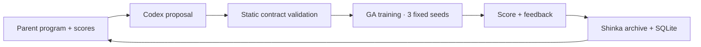

<div align="center">

# Shinka Continual Reinforcement Learning

**Reproducing continual neuroevolution · Searching with ShinkaEvolve**

[Reference paper](https://arxiv.org/abs/2610.01583v1) · [Experimental roadmap](docs/experimental-roadmap.md) · [Shinka task](tasks/cartpole_ga/README.md) · [Source pins](upstream.lock.json)

<sub>A living research report · CartPole study · October 2026</sub>

</div>

---

## Abstract

This project investigates whether program search can improve neuroevolution in continual reinforcement learning. We begin with a controlled reproduction of *Continual Reinforcement Learning with Neuroevolution* by Nisioti, Cossu, Korte, and Risi (2026), using their pinned implementation of genetic algorithms (GA), evolution strategies (ES), and proximal policy optimization (PPO). The first environment is CartPole with alternating observation offsets. Our initial ShinkaEvolve extension searches two static GA hyperparameters under a fixed development budget. CPU smoke runs validate all three learners; a three-seed development evaluation measures 114.69 seconds per candidate on two logical CPUs. The full ten-trial comparison remains pending; no reproduced findings or improvements over the reference paper are claimed.

> **Study status:** CPU pipeline and search timing validated on 2 October 2026 · Subscription configuration prepared · Matched pilot and LLM search pending.

## 1. Research questions

1. Can the pinned reference implementation reproduce the reported continual-learning behavior on the two-task CartPole experiment?
2. Does a ShinkaEvolve-selected GA configuration improve held-out performance relative to the original GA and a search-budget-matched random-search control?

The first extension searches mutation scale `sigma` and archive fraction `elite_ratio`. Adaptive learning rules and direct evolution of policy programs are future experiments.

## 2. Experimental design

**Task.** The reference cell is `CartPole-v1_sigma0.5`: the original environment alternates with a fixed observation offset. Training receives no explicit task-boundary signal. We preserve the upstream policy architecture, task construction, environment dynamics, and centroid evaluation.

**Full comparison.** Ten trials use seeds 42–51 and task trials 1–10. Each learner has the same nominal training environment-step budget; evaluation and diagnostics are accounted for separately.

| Protocol component | GA | ES | PPO |
| :--- | ---: | ---: | ---: |
| Distinct tasks / phases | 2 / 20 | 2 / 20 | 2 / 20 |
| Generations or updates per phase | 200 | 200 | 1,500 |
| Total generations or updates | 4,000 | 4,000 | 30,000 |
| Population or parallel environments | 512 | 512 | 2,048 |
| Training episodes per candidate | 3 | 3 | — |
| Rollout steps per PPO update | — | — | 50 |
| Episode cap | 500 | 500 | 500 |
| Evaluation episodes per checkpoint | 10 | 10 | 10 |
| Nominal training steps per trial | 3.072 × 10⁹ | 3.072 × 10⁹ | 3.072 × 10⁹ |

<sub>Table 1. Planned full CartPole protocol. GA uses `sigma=0.5`, `elite_ratio=0.5`; ES uses `sigma=0.1`, learning rate `0.05`, SGD, and z-score fitness. PPO retains the upstream paper hyperparameters.</sub>

The `paper-cartpole` profile explicitly requests **20 phases**. The upstream YAML default is 10; running that default does not reproduce this protocol. See the [reproduction plan](docs/reproduction-plan.md) for source links and the separate ten-distinct-task experiment.

**Development and reporting separation.** The profiles below are fixed outside the candidate program. Development task trials use `trial=seed+1`, keeping both seeds and observation-offset draws separate from the reporting trials.

| Profile | Role | Seeds | Phases | Training budget |
| :--- | :--- | :--- | ---: | :--- |
| `smoke` | Validate execution and artifacts | 1001 | 2 | 4 generations/updates; episode cap 32 |
| `search` | Select GA configurations | 1001–1003 | 4 | 80 generations × 64 candidates × 3 episodes |
| `paper-cartpole` | Final reporting | 42–51 | 20 | Full protocol in Table 1 |

<sub>Table 2. Experiment profiles. Smoke budgets are intentionally small and are not compute-matched across methods.</sub>

## 3. ShinkaEvolve extension

[ShinkaEvolve](https://sakanaai.github.io/ShinkaEvolve/) proposes candidate programs through LLM-guided mutation and evolutionary search. In this study, each candidate supplies a literal `get_ga_config()` dictionary to the unchanged upstream GA.

| Search variable | Admissible range | Initial configuration |
| :--- | ---: | ---: |
| Mutation scale, `sigma` | [0.001, 2.0] | 0.5 |
| Archive fraction, `elite_ratio` | [0.05, 0.95] | 0.5 |

<sub>Table 3. Initial search space. The evaluator parses candidate syntax without importing or executing the submitted program.</sub>

Population size, task schedule, episode cap, seeds, and scoring are fixed by the harness. A candidate's development score is its active-task centroid return, averaged across training checkpoints and development seeds, divided by the episode cap:

$$
J(\theta) = \frac{1}{|S|} \sum_{s \in S}
\frac{1}{T H} \sum_{t=1}^{T} R^{\mathrm{centroid}}_{s,t,a(t)}(\theta).
$$

Here, $a(t)$ is the active task, $H$ the episode cap, and $T$ the number of recorded generations. Larger scores are better. This objective selects configurations; final reporting additionally requires the paper's learning accuracy, forgetting, cumulative return, and zero-shot transfer metrics with uncertainty across trials. The selected configuration must be frozen before reporting trials.

The complete initial candidate is:

```python
# EVOLVE-BLOCK-START
def get_ga_config():
    return {"sigma": 0.5, "elite_ratio": 0.5}
# EVOLVE-BLOCK-END
```

There are two distinct evolutionary loops. Shinka selects a parent program from its archive and asks Codex to propose a code mutation. The fixed evaluator then trains a fresh population of policy networks for each development seed. One outer candidate therefore requires **three trials × 80 inner GA generations**, or 23.04 million nominal training steps. Policy weights are not inherited between candidate evaluations.



The planned first search has one initial candidate and **24 proposal slots**, compared with a matched random-search control. Shinka's total generation targets are **5 → 13 → 25**; each completed block can be resumed from the same result directory. These are targets for attempts, not guarantees of distinct valid programs. A higher active-task score alone is not evidence of reduced forgetting.

The subsequent algorithm-search experiment will evolve a pure `update_sigma(sigma, stats, memory)` function using training statistics and bounded persistent state. It will preserve the baseline's selection, policy, random stream, and budgets. This adaptive interface is specified in the [roadmap](docs/experimental-roadmap.md), but is not yet implemented.

## 4. Results

### Pipeline validation

Real training, metric validation, and the Shinka evaluator contract all completed successfully on CPU. The validation used seed 1001, task trial 1002, four generations or updates, and an episode cap of 32. Python 3.11.15 and JAX 0.5.3 ran on two logical CPUs; the sequential suite took 56.23 seconds, including startup and compilation.

| Run | Valid metric rows | Mean active-task return | Normalized score | Wall time (s) | Status |
| :--- | ---: | ---: | ---: | ---: | :--- |
| GA baseline | 4 | 10.00 | 0.312500 | 20.77 | Pass |
| ES baseline | 4 | 12.50 | 0.390625 | 11.61 | Pass |
| PPO baseline | 4 | 23.50 | 0.734375 | 8.13 | Pass |
| Initial Shinka candidate | 4 | 10.00 | 0.312500 | 14.67 | Pass |

<sub>Table 4. Observed smoke results, 2 October 2026. Returns average active-task centroid evaluations across four checkpoints. Wall times include trainer startup and compilation. These values validate execution; unequal budgets and one seed preclude a scientific comparison.</sub>

The initial candidate matches the default GA score and returns `correct: true`, validating the evaluator without model calls. The [evidence archive](reports/smoke-20261002) contains raw metrics, resolved configurations, logs, environment details, and checksums. The first execution exposed a log-file collision; the validated rerun separates harness output (`process.log`) from the upstream training log (`train.log`). The first attempt is retained locally.

### Development runtime calibration

The unchanged initial candidate also completed the full `search` profile: 80 generations per seed, four alternating phases, population 64, three training and evaluation episodes, and a 500-step cap. The three sequential trials took **114.69 seconds** including imports, compilation, training, and scoring. Maximum individual child-process resident memory was 722 MiB; this is not aggregate system memory.

| Development seed | Task trial | Generations | Wall time (s) |
| :--- | ---: | ---: | ---: |
| 1001 | 1002 | 80 | 43.82 |
| 1002 | 1003 | 80 | 28.46 |
| 1003 | 1004 | 80 | 42.03 |
| **Complete candidate evaluation** | **3 trials** | **240** | **114.69** |

<sub>Table 5. Measured search evaluation on two logical CPUs, 2 October 2026. The complete duration includes evaluator overhead. This is one configuration's runtime calibration, not an estimate of variation across configurations or an algorithm comparison. [Protocol, raw evidence, and checksums](reports/search-timing-20261002).</sub>

At this measured rate, 25 candidate evaluations require approximately 48 minutes of local training. Assuming an additional 0.5–2 minutes per Codex proposal, the planned search takes approximately **60–100 minutes** before review, retries, or quota pauses. Proposal latency is an assumption to replace after the first block. The 24-configuration random control adds approximately 46 minutes of evaluation. These projections apply to the current reduced profile; they do not estimate full-paper runtime.

### Scientific evaluation

No full-budget comparison has been completed. The table below tracks the evidence needed to answer the research questions.

| Experiment | Required evidence | Status |
| :--- | :--- | :--- |
| Reference GA / ES / PPO | Ten trials, full task schedule, continual-learning metrics | Pending |
| Stationary control | Matched task and learner settings without switching | Pending |
| Shinka-selected GA | Frozen candidate evaluated on reporting trials | Pending |
| Random-search control | Matched search budget and reporting protocol | Pending |

## 5. Reproducibility

Requires Git, [uv](https://docs.astral.sh/uv/), and Python 3.11. The harness, reference trainer, and optional Shinka dependency are installed separately.

```bash
git clone https://github.com/ReloadLightly/shinka-continual-reinforcement-learning.git
cd shinka-continual-reinforcement-learning
uv sync --frozen --group dev
uv run --frozen pytest
uv run --frozen ruff check .

# Fetch the exact reference commit into ignored .upstream/.
uv run --frozen python scripts/bootstrap_upstream.py
```

For the initial CartPole validation on Linux x86_64 with CPython 3.11, install the hash-locked CPU subset of the reference dependencies. This keeps their original exact versions in a separate upstream `.venv` and omits CUDA, Torch, and unrelated benchmarks:

```bash
uv run --frozen python scripts/bootstrap_cpu.py

# Alternative: install the complete original reference environment.
uv run --frozen python scripts/bootstrap_upstream.py --install
```

The baseline launcher and candidate evaluator accept `SHINKA_CRL_UPSTREAM` and `SHINKA_CRL_PYTHON` to select an existing pinned checkout and interpreter. The smoke suite accepts `--upstream` and `--python`. The reference uses JAX 0.5.3; keep its environment separate from Shinka's dependency set.

The baseline launcher prints a plan unless `--execute` is supplied; the smoke suite starts training directly. The commands below use fresh local output paths. Choose a new suffix for subsequent reruns: completed and failed runs are preserved. The published evidence is checked in at `reports/smoke-20261002`.

```bash
# Inspect the plan without starting training.
uv run --frozen python scripts/run_baseline.py --profile smoke --method ga

# Run GA, ES, PPO, and the initial Shinka candidate sequentially on two logical CPUs.
uv run --frozen python scripts/run_smoke.py \
  --results-dir results/smoke-local --cpus 2 --timeout 600

# Export reviewable evidence, including raw metrics, logs, and checksums.
uv run --frozen python scripts/report_smoke.py \
  --runs-root results/smoke-local --output reports/smoke-local

# Preview the full ten-trial protocol.
uv run --frozen python scripts/run_baseline.py --profile paper-cartpole --method ga
```

For full-budget training, set `--timeout` to suit the available hardware; the default is 1,800 seconds per trial. The [task documentation](tasks/cartpole_ga/README.md) covers candidate validation, provider configuration, and explicit Shinka launches. Installing the optional `shinka` extra does not start a model search.

The planned model route uses Shinka's native `headless/codex` provider and local ChatGPT authentication. [Codex documentation](https://learn.chatgpt.com/docs/auth) distinguishes subscription login from separately billed API-key usage. The dedicated subscription configuration disables embeddings and auxiliary model calls; its guarded adapter checks ChatGPT login and forces that authentication method. Included usage remains subject to the account's [current limits](https://learn.chatgpt.com/docs/pricing). No model proposals have been run for this study, and a paid API key is not required for the planned pilot.

Each real trial retains its command, profile, seed, task trial, source revision, interpreter version, device selection, duration, upstream configuration and metrics, training log, and metric-file hash. Modified upstream tracked files and untracked source files are rejected. Source revisions are fixed in [`upstream.lock.json`](upstream.lock.json):

| Component | Pinned revision |
| :--- | :--- |
| Reference trainer | [`821570eb6a22`](https://github.com/eleninisioti/continual_neuroevolution/tree/821570eb6a22db0f7aa77111b2ea541fe8fa795b) |
| ShinkaEvolve | [`9912af12d423`](https://github.com/SakanaAI/ShinkaEvolve/tree/9912af12d423504b8d580f4179fd15f5f88b8c50) |
| Reference paper | [arXiv:2610.01583v1](https://arxiv.org/abs/2610.01583v1) |

The [GitHub Actions template](ci/github-actions.yml) runs the harness checks. CI remains inactive until that file is installed as `.github/workflows/checks.yml` with a GitHub session that has workflow write permission.

## 6. Limitations and next experiment

The current search space contains two static GA settings. It cannot discover adaptive update rules, change policies, or alter experiment budgets. Reduced-budget development scores may not predict performance across the full task sequence. Smoke scores support no ranking of GA, ES, and PPO because they use one seed and unmatched training budgets.

The next experiment is an **18-trial matched baseline pilot**: GA, ES, and PPO × stationary and alternating conditions × three development seeds. Each trial uses four phases, a 500-step episode cap, and 7.68 million nominal training steps. GA/ES use 80 generations with population 64 and three training episodes; PPO uses 600 updates with 256 environments and 50 rollout steps. Held-out evaluation uses ten episodes. This reduced protocol must pass task-transition and metric checks before configuration search begins.

The [experimental roadmap](docs/experimental-roadmap.md) specifies stage gates, random controls, reserved validation seeds, the adaptive-program interface, and the work still needed to execute the pilot. The [reproduction specification](docs/reproduction-plan.md) preserves the full paper protocol. Full-paper reproduction additionally requires other environments, task variations, continual PPO variants, and neighborhood analysis.

## References

**[1]** Eleni Nisioti, Andrea Cossu, Kathrin Korte, and Sebastian Risi. *Continual Reinforcement Learning with Neuroevolution*. arXiv:2610.01583v1, 2026. [Paper](https://arxiv.org/abs/2610.01583v1) · [Reference implementation](https://github.com/eleninisioti/continual_neuroevolution).

**[2]** Sakana AI. *ShinkaEvolve*. [Documentation](https://sakanaai.github.io/ShinkaEvolve/) · [Source](https://github.com/SakanaAI/ShinkaEvolve).

<sub>The reference implementation is fetched as an external checkout. No top-level license was present at the pinned revision; its source is not vendored here.</sub>
