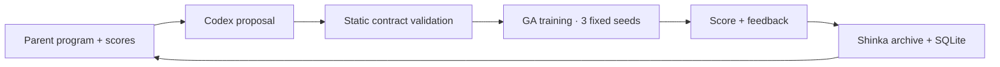
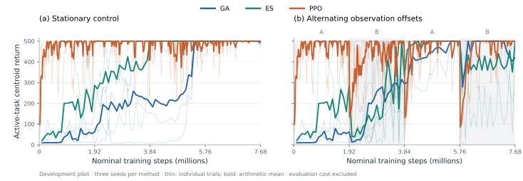
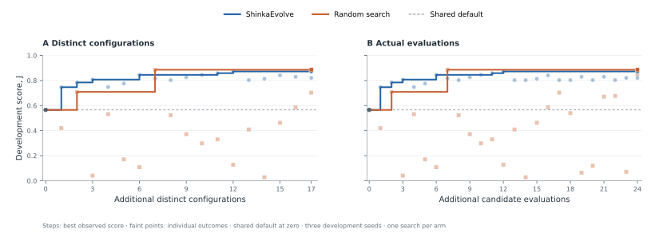

<div align="center">

# Shinka Continual Reinforcement Learning

**Reproducing continual neuroevolution · Searching with ShinkaEvolve**

[Reference paper](https://arxiv.org/abs/2610.01583v1) · [Experimental roadmap](docs/experimental-roadmap.md) · [Shinka task](tasks/cartpole_ga/README.md) · [Source pins](upstream.lock.json)

<sub>A living research report · CartPole study · October 2026</sub>

</div>

---

## Abstract

This project pursues a controlled reproduction of *Continual Reinforcement Learning with Neuroevolution* by Nisioti, Cossu, Korte, and Risi (2026), with ShinkaEvolve as a separately evaluated extension. We preserve the pinned GA, ES, and PPO implementations, beginning with CartPole under alternating observation offsets. An 18-trial CPU pilot passed the predefined stationary-learning gate for all three methods. The completed static-search pilot evaluated 25 Shinka programs, including the default, and 24 random controls: 147 seed trials and 1.129 billion nominal training steps. Shinka produced 17 distinct mutations and 7 repeated evaluations. Best development scores were 0.8721 for Shinka, 0.8857 for the full random pool, and 0.5654 for the default. These selected outcomes from one search per arm do not establish search-method superiority, retention, or generalization. Static tuning supplies the baseline for the main extension, executable adaptive mutation rules.

> **Study status:** Baseline pilot and 25/24 static-search endpoint complete · Full-budget development timing and finalist validation next · Adaptive rules and full reproduction pending.

## 1. Research questions

1. Can the pinned reference implementation reproduce the reported continual-learning behavior on the two-task CartPole experiment?
2. Does a ShinkaEvolve-selected GA configuration improve held-out performance relative to the original GA and a search-budget-matched random-search control?
3. Can ShinkaEvolve discover executable adaptive mutation rules that improve learning and retention relative to static tuning and the reference's existing adaptive mechanism?

The first extension searches mutation scale `sigma` and archive fraction `elite_ratio`. This is LLM-guided hyperparameter optimization and supplies a baseline for the main extension: adaptive learning rules. It cannot discover new selection or memory mechanisms through the current two-number interface.

## 2. Experimental design

**Task.** The reference cell is `CartPole-v1_sigma0.5`: the original environment alternates with a fixed observation offset. Training receives no explicit task-boundary signal. We preserve the upstream policy architecture, task construction, environment dynamics, and centroid evaluation.

**Full comparison.** Ten trials use seeds 42–51 and task trials 1–10. Each learner has the same nominal training environment-step budget; evaluation and diagnostics are accounted for separately.

| Protocol component | GA | ES | PPO |
| :--- | ---: | ---: | ---: |
| Distinct tasks / phases | 2 / 20 | 2 / 20 | 2 / 20 |
| Generations or updates per phase | 200 | 200 | 1,500 |
| Total generations or updates | 4,000 | 4,000 | 30,000 |
| Population or parallel environments | 512 | 512 | 2,048 |
| Training episodes per candidate | 3 | 3 | — |
| Rollout steps per PPO update | — | — | 50 |
| Episode cap | 500 | 500 | 500 |
| Evaluation episodes per checkpoint | 10 | 10 | 10 |
| Nominal training steps per trial | 3.072 × 10⁹ | 3.072 × 10⁹ | 3.072 × 10⁹ |

<sub>Table 1. Planned full CartPole protocol. GA uses `sigma=0.5`, `elite_ratio=0.5`; ES uses `sigma=0.1`, learning rate `0.05`, SGD, and z-score fitness. PPO retains the upstream paper hyperparameters.</sub>

The `paper-cartpole` profile explicitly requests **20 phases**. The upstream YAML default is 10; running that default does not reproduce this protocol. See the [reproduction plan](docs/reproduction-plan.md) for source links and the separate ten-distinct-task experiment.

**Development and reporting separation.** The profiles below are fixed outside the candidate program. Development task trials use `trial=seed+1`, keeping both seeds and observation-offset draws separate from the reporting trials.

| Profile | Role | Seeds | Phases | Training budget |
| :--- | :--- | :--- | ---: | :--- |
| `smoke` | Validate execution and artifacts | 1001 | 2 | 4 generations/updates; episode cap 32 |
| `search` | Select GA configurations | 1001–1003 | 4 | 80 generations × 64 candidates × 3 episodes |
| `pilot-stationary` / `pilot-switching` | Matched baseline development comparison | 1001–1003 | 4 | 7.68 × 10⁶ nominal steps per learner and trial |
| `cartpole-validation` | One frozen finalist comparison | 2001–2005 | 4 | 320 generations × 64 candidates × 3 episodes |
| `paper-cartpole-timing` | Default-GA development reference | 1001 | 20 | 3.072 × 10⁹ nominal steps; final seeds excluded |
| `paper-cartpole` | Final reporting | 42–51 | 20 | Full protocol in Table 1 |

<sub>Table 2. Experiment profiles. Smoke budgets are intentionally small and are not compute-matched across methods.</sub>

**Pilot measurements.** GA and ES are reported through their saved centroids;
PPO through its saved policy. Ten fresh greedy evaluation episodes per checkpoint
measure learning accuracy (LA), consecutive-switch forgetting (F), and zero-shot
transfer (ZT). Both switching directions enter forgetting, and negative values
are retained. Stationary transfer metrics are left undefined. Post-hoc evaluation
preserves the reference's method-specific random-key derivation; a shared base
evaluation seed does not imply identical episodes across methods.

Cumulative return follows the reference's completed-update clock and unit
NE-generation resampling grid before trapezoidal integration. The evidence also
retains an integral over every logged sample, because the two conventions can
differ for PPO. The first observed return is held back to step zero; it is not a
measurement of an untrained policy. Raw reward units and fixed `/500`
normalization remain distinct from the paper's reference-based rescaling.

## 3. ShinkaEvolve extension

[ShinkaEvolve](https://sakanaai.github.io/ShinkaEvolve/) proposes candidate programs through LLM-guided mutation and evolutionary search. In this study, each candidate supplies a literal `get_ga_config()` dictionary to the unchanged upstream GA.

| Search variable | Admissible range | Initial configuration |
| :--- | ---: | ---: |
| Mutation scale, `sigma` | [0.001, 2.0] | 0.5 |
| Archive fraction, `elite_ratio` | [0.05, 0.95] | 0.5 |

<sub>Table 3. Initial search space. The evaluator parses candidate syntax without importing or executing the submitted program.</sub>

Population size, task schedule, episode cap, seeds, and scoring are fixed by the harness. A candidate's development score is its active-task centroid return, averaged across training checkpoints and development seeds, divided by the episode cap:

$$
J(\theta) = \frac{1}{|S|} \sum_{s \in S}
\frac{1}{T H} \sum_{t=1}^{T} R^{\mathrm{centroid}}_{s,t,a(t)}(\theta).
$$

Here, $a(t)$ is the active task, $H$ the episode cap, and $T$ the number of recorded generations. Larger scores are better. This objective selects configurations; final reporting additionally requires the paper's learning accuracy, forgetting, cumulative return, and zero-shot transfer metrics with uncertainty across trials. The selected configuration must be frozen before reporting trials.

The complete initial candidate is:

```python
# EVOLVE-BLOCK-START
def get_ga_config():
    return {"sigma": 0.5, "elite_ratio": 0.5}
# EVOLVE-BLOCK-END
```

There are two distinct evolutionary loops. Shinka selects a parent program from its archive and asks Codex to propose a code mutation. The fixed evaluator then trains a fresh population of policy networks for each development seed. One outer candidate therefore requires **three trials × 80 inner GA generations**, or 23.04 million nominal training steps. Policy weights are not inherited between candidate evaluations.



The planned first search has one initial candidate and **24 proposal slots**, compared with a matched random-search control. Shinka's total generation targets are **5 → 13 → 25**; each completed block can be resumed from the same result directory. These are targets for attempts, not guarantees of distinct valid programs. A higher active-task score alone is not evidence of reduced forgetting.

The planned adaptive interface, `update_sigma(sigma, stats, memory)`, will instead
execute after each GA update and control the next generation's mutation width.
Its five training-only statistics and four persistent memory values permit
behavior that changes during learning, without a task-boundary signal. The
[adaptive protocol](docs/experimental-roadmap.md#7-second-search-space-adaptive-mutation-programs)
specifies a neutral identity rule, a fixed arithmetic adaptation rule, both static
search winners, and the upstream `ga_focus` as controls. The latter also adapts
parent selection and preserves fixed-width explorers; it is a whole-method
comparison. It remains separate from the paper's plain-GA CartPole baseline.
The new interface preserves the baseline's selection, policy, random stream,
and training budget; it is specified but not yet implemented.
The [implementation specification](docs/adaptive-programs.md) defines the exact
trainer hook, executable grammar, memory, width timing, and focused checks.
Its proposed objective combines active return with performance on the previous
task after a switch; the paper's learning and forgetting metrics remain separate.

## 4. Results

### Pipeline validation

Real training, metric validation, and the Shinka evaluator contract all completed successfully on CPU. The validation used seed 1001, task trial 1002, four generations or updates, and an episode cap of 32. Python 3.11.15 and JAX 0.5.3 ran on two logical CPUs; the sequential suite took 56.23 seconds, including startup and compilation.

| Run | Valid metric rows | Mean active-task return | Normalized score | Wall time (s) | Status |
| :--- | ---: | ---: | ---: | ---: | :--- |
| GA baseline | 4 | 10.00 | 0.312500 | 20.77 | Pass |
| ES baseline | 4 | 12.50 | 0.390625 | 11.61 | Pass |
| PPO baseline | 4 | 23.50 | 0.734375 | 8.13 | Pass |
| Initial Shinka candidate | 4 | 10.00 | 0.312500 | 14.67 | Pass |

<sub>Table 4. Observed smoke results, 2 October 2026. Returns average active-task centroid evaluations across four checkpoints. Wall times include trainer startup and compilation. These values validate execution; unequal budgets and one seed preclude a scientific comparison.</sub>

The initial candidate matches the default GA score and returns `correct: true`, validating the evaluator without model calls. The [evidence archive](reports/smoke-20261002) contains raw metrics, resolved configurations, logs, environment details, and checksums. The first execution exposed a log-file collision; the validated rerun separates harness output (`process.log`) from the upstream training log (`train.log`). The first attempt is retained locally.

### Development runtime calibration

The unchanged initial candidate also completed the full `search` profile: 80 generations per seed, four alternating phases, population 64, three training and evaluation episodes, and a 500-step cap. The three sequential trials took **114.69 seconds** including imports, compilation, training, and scoring. Maximum individual child-process resident memory was 722 MiB; this is not aggregate system memory.

| Development seed | Task trial | Generations | Wall time (s) |
| :--- | ---: | ---: | ---: |
| 1001 | 1002 | 80 | 43.82 |
| 1002 | 1003 | 80 | 28.46 |
| 1003 | 1004 | 80 | 42.03 |
| **Complete candidate evaluation** | **3 trials** | **240** | **114.69** |

<sub>Table 5. Measured search evaluation on two logical CPUs, 2 October 2026. The complete duration includes evaluator overhead. This is one configuration's runtime calibration, not an estimate of variation across configurations or an algorithm comparison. [Protocol, raw evidence, and checksums](reports/search-timing-20261002).</sub>

The pre-search projection used this rate to estimate approximately 48 minutes
for 25 candidate evaluations. Assuming an additional 0.5–2 minutes per Codex
proposal gave **60–100 minutes** for Shinka, with approximately 46 minutes for
24 random controls. These historical estimates are superseded by the measured
execution costs and proposal latency in the [configuration-search results](#subscription-backed-configuration-search).
Neither projection estimates full-paper runtime.

The native Shinka loop also passed an independent execution test with a fixed
local response and **zero model requests**. It evaluated generations 0 and 1,
resumed the same SQLite archive, and added generation 2 with verified parentage
0 → 1 → 2. The initial smoke score remained 0.3125. The repeated fixture candidate
demonstrated that duplicate evaluations still consume training work. This tests
transport, evaluation, and resume, rather than proposal quality; all artifacts
are retained in the [native integration evidence](reports/native-integration-20261002/summary.json).

Runtime inspection before the first model proposal found that native Shinka
overrode the outer numerical thread cap with eight threads. The initial search
setup was stopped after two complete seeds and one partial seed, preserving
15.36 million completed nominal steps plus unquantified partial work. No model
request occurred. The corrected job configuration explicitly caps numerical
threads at one in both search arms and records the evaluator's actual runtime.
This setup attempt is excluded from candidate comparisons and retained in the
[interrupted-attempt evidence](reports/search-setup-interrupted-20261002/summary.json).

### Matched development pilot

The pilot completed GA, ES, and PPO under stationary and alternating conditions
on seeds 1001–1003. Every trial used four phases and 7.68 million nominal training
steps; ten fresh episodes evaluated each saved phase checkpoint. Training,
analysis, and verification took **36.08 minutes** on two logical CPUs across two
sessions. Resuming verified and reused the first six trials without retraining.



<sub>Figure 1. Observed active-task centroid returns at matched nominal training steps. Thin lines show individual trials; bold lines show three-seed means, with no smoothing or confidence bands. Shaded phases introduce a fixed observation offset. [Vector PDF](figures/pilot-20261002.pdf) · [Figure provenance](figures/pilot-20261002.json).</sub>

| Condition | Method | LA ↑ | F ↓ | LA − F ↑ | ZT ↑ | Cum. / (steps × 500) ↑ |
| :--- | :--- | ---: | ---: | ---: | ---: | ---: |
| Stationary | GA | 315.2 ± 77.7 | — | — | — | 0.506 ± 0.176 |
| Stationary | ES | 448.4 ± 51.5 | — | — | — | 0.745 ± 0.135 |
| Stationary | PPO | 476.3 ± 41.0 | — | — | — | 0.964 ± 0.002 |
| Switching | GA | 321.0 ± 82.3 | −9.3 ± 62.6 | 330.3 ± 119.1 | 166.2 ± 89.8 | 0.561 ± 0.114 |
| Switching | ES | 407.3 ± 35.5 | 127.8 ± 127.5 | 279.5 ± 147.6 | 137.7 ± 109.0 | 0.604 ± 0.154 |
| Switching | PPO | 481.2 ± 18.0 | 360.0 ± 156.7 | 121.2 ± 140.4 | 104.4 ± 122.6 | 0.908 ± 0.045 |

<sub>Table 6. Observed development metrics, mean ± sample standard deviation across three trials. LA, F, LA − F, and ZT use raw CartPole reward units; the final column is the reference-grid cumulative integral divided by nominal training steps and episode cap. It is not the paper's reference-based rescaling. Stationary transfer metrics are undefined. LA averages all four phase endpoints, so it can be lower than final-phase performance. [Complete evidence and per-trial values](reports/pilot-20261002/summary.json).</sub>

All three methods passed the predefined adequacy gate: every stationary trial
finished with last-phase mean return above 400. GA and ES also improved by at
least 50 points between their first and last phases in all three trials. PPO
learned early and passed through the final-performance criterion. This supports
using the reduced budget for development; it is not a significance test.

Under switching, PPO has the highest observed learning accuracy and cumulative
return, alongside the largest measured forgetting. GA's lower forgetting
coincides with lower learning accuracy, illustrating why retention alone is
insufficient. The negative GA forgetting estimate is preserved rather than
clamped. For example, switching GA seed 1002 improves on task A from 158.6 to
500.0 after its first switch, then loses 135.4 and 141.5 reward points on the
previous task at the next two switches. Its mean forgetting is therefore −21.5,
despite those later losses ([individual switch measurements](reports/pilot-20261002/raw/trials/pilot-switching/ga/seed_1002/analysis/attempt_001/summary.json)).
With only three trials, four phases, and reduced populations, these
outcomes do not establish a general method ranking or reproduce the full study.
The [evidence archive](reports/pilot-20261002) includes resolved configurations,
raw trajectories and episode returns, source/runtime provenance, artifact
checksums, and the complete gate decision. Binary checkpoints remain local.

### Subscription-backed configuration search

The declared static-search endpoint completed **25 Shinka programs, including
the shared default, and 24 random controls**. Every evaluation used three
development seeds, four phases, and 23.04 million nominal training steps.
All evaluations passed. The 24 Shinka proposals yielded **17 distinct mutations
and 7 duplicate evaluations**; repeated training remains charged.



<sub>Figure 2. A: the declared primary comparison matches distinct configurations, using the first 17 frozen random controls; it does not equalize actual training work. B: all 24 additional evaluations per arm, including repeated Shinka configurations. Both panels share the default at zero. Steps show the best observed score and faint markers retain individual outcomes. [PDF](figures/search-endpoint-20261002.pdf) · [Exact values and hashes](figures/search-endpoint-20261002.json).</sub>

| Configuration | Mutation width, σ | Archive fraction | Elites / 64 | Development score, J ↑ |
| :--- | ---: | ---: | ---: | ---: |
| Shared default | 0.500000 | 0.500000 | 32 | 0.5654 ± 0.1168 |
| Best Shinka · program 12 | 0.080000 | 0.075000 | 4 | 0.8721 ± 0.0578 |
| Best random · first 17 controls | 0.330187 | 0.062208 | 3 | 0.8857 ± 0.0275 |
| Best random · all 24 controls | 0.330187 | 0.062208 | 3 | 0.8857 ± 0.0275 |

<sub>Table 7. Selected development maxima, 2 October 2026. J averages active-task centroid return divided by 500 across 80 checkpoints and three seeds; entries show mean ± sample standard deviation across seeds. The first-17 prefix is the declared matched-distinct comparison. All 24 controls form the secondary comparison with equal numbers of additional candidate evaluations, sharing the default. Parameters are rounded; [all 49 evaluations and per-seed results](reports/search-endpoint-20261002/summary.json) retain exact values.</sub>

Random search has the higher observed maximum in the matched prefix and the
full control pool. The Shinka incumbent did not improve beyond the
[13-program checkpoint](reports/search-stage13-20261002/summary.json).
These are selected development outcomes from one search per arm; they do not
establish search-method superiority, retention, or held-out improvement.
Both arms' top two distinct configurations and the default are retained for
one reserved validation comparison.

Repeated proposals are an observed limitation of this run. For example,
[program 20's prompt](reports/search-endpoint-20261002/raw/shinka/gen_20/attempts/novelty_1/resample_1/patch_1/headless_prompt.md)
includes selected high-scoring examples but omits earlier lower-scoring
evaluations of its repeated setting. Its response extrapolates from those
examples and proposes the setting again. Incomplete sampled context is a
plausible mechanism; this inspection does not establish sole causality.
The frozen proposer and retraining policy were preserved throughout.

| Observed cumulative cost | Shinka, including default | Additional random control | Total |
| :--- | ---: | ---: | ---: |
| Configuration evaluations | 25 | 24 | 49 |
| Completed seed trials | 75 | 72 | 147 |
| Nominal training steps | 576.00 × 10⁶ | 552.96 × 10⁶ | 1,128.96 × 10⁶ |
| Execution time (min) | 59.77 | 42.06 | 101.84 |
| Successful Codex responses | 24 | 0 | 24 |

<sub>Table 8. Actual execution costs through the declared endpoint, including all duplicate evaluations and counting the shared default once. Wall time sums completed sessions, including startup, proposals, training, evaluation, and checkpoint handling. Setup, preflight, review pauses, and the separately archived interrupted setup attempt are excluded.</sub>

All 24 proposals used GPT-6.1 Sol at medium effort through guarded local ChatGPT
authentication, without an API-key route. Response times ranged from
13.5 to 23.1 seconds. Native usage records report 154,065 uncached input
tokens and 3,967 output tokens; cached input, reasoning/tool counts, and remaining
subscription allowance are unavailable. Shinka's dollar estimates are API-price
equivalents, not billing receipts. The [endpoint evidence](reports/search-endpoint-20261002)
retains prompts, responses, exact programs, ancestry, raw trajectories,
runtime receipts, usage records, and hashes. All scores were independently
reconstructed. The [five-program](reports/search-integration-20261002/summary.json)
and [13-program](reports/search-stage13-20261002/summary.json) checkpoints remain
available.

The static search is closed. The next experiments measure one full-budget
development reference trial and evaluate the frozen static finalists. Validation
feedback will not be used for further proposals from this archive.

### Remaining scientific evaluation

No full-budget comparison has been completed. The table below tracks the evidence needed to answer the research questions.

| Experiment | Required evidence | Status |
| :--- | :--- | :--- |
| Reference GA / ES / PPO | Ten trials, full task schedule, continual-learning metrics | Pilot complete; full protocol pending |
| Stationary control | Matched task and learner settings without switching | Development control complete |
| Shinka-selected GA | Frozen candidate evaluated on reporting trials | 25-program search complete; validation pending |
| Random-search control | Matched search budget and reporting protocol | 24-control search complete; validation pending |

## 5. Reproducibility

Requires Git, [uv](https://docs.astral.sh/uv/), and Python 3.11. The harness, reference trainer, and optional Shinka dependency are installed separately.

```bash
git clone https://github.com/ReloadLightly/shinka-continual-reinforcement-learning.git
cd shinka-continual-reinforcement-learning
uv sync --frozen --group dev
uv run --frozen pytest
uv run --frozen ruff check .

# Fetch the exact reference commit into ignored .upstream/.
uv run --frozen python scripts/bootstrap_upstream.py
```

For the initial CartPole validation on Linux x86_64 with CPython 3.11, install the hash-locked CPU subset of the reference dependencies. This keeps their original exact versions in a separate upstream `.venv` and omits CUDA, Torch, and unrelated benchmarks:

```bash
uv run --frozen python scripts/bootstrap_cpu.py

# Alternative: install the complete original reference environment.
uv run --frozen python scripts/bootstrap_upstream.py --install
```

The baseline launcher and candidate evaluator accept `SHINKA_CRL_UPSTREAM` and `SHINKA_CRL_PYTHON` to select an existing pinned checkout and interpreter. The smoke suite accepts `--upstream` and `--python`. The reference uses JAX 0.5.3; keep its environment separate from Shinka's dependency set.

The baseline launcher prints a plan unless `--execute` is supplied; the smoke suite starts training directly. The commands below use fresh local output paths. Choose a new suffix for subsequent reruns: completed and failed runs are preserved. The published evidence is checked in at `reports/smoke-20261002`.

```bash
# Inspect the plan without starting training.
uv run --frozen python scripts/run_baseline.py --profile smoke --method ga

# Run GA, ES, PPO, and the initial Shinka candidate sequentially on two logical CPUs.
uv run --frozen python scripts/run_smoke.py \
  --results-dir results/smoke-local --cpus 2 --timeout 600

# Export reviewable evidence, including raw metrics, logs, and checksums.
uv run --frozen python scripts/report_smoke.py \
  --runs-root results/smoke-local --output reports/smoke-local

# Preview the full ten-trial protocol.
uv run --frozen python scripts/run_baseline.py --profile paper-cartpole --method ga
```

The matched pilot is independently executable and resumes at trial boundaries.
It validates exact source/profile identity, runtime packages, resolved baseline
settings, task vectors, checkpoint shapes, and artifact hashes before reusing a
completed trial. Failed attempts remain in their original directories; a retry
uses a fresh attempt directory.

```bash
# Preview all 18 jobs and their matched budget.
uv run --frozen python scripts/run_pilot.py --results-dir results/pilot-local

# Complete one six-trial block, then resume the remaining trials.
uv run --frozen python scripts/run_pilot.py \
  --results-dir results/pilot-local --execute --max-trials 6
uv run --frozen python scripts/run_pilot.py \
  --results-dir results/pilot-local --execute --resume

# Validate and publish compact evidence; keep binary checkpoints local.
uv run --frozen python scripts/report_pilot.py \
  --runs-root results/pilot-local --output reports/pilot-local
.upstream/continual_neuroevolution/.venv/bin/python scripts/plot_pilot.py \
  --report-dir reports/pilot-local --output figures/pilot-local.svg
```

For full-budget training, set `--timeout` to suit the available hardware; the default is 1,800 seconds per trial. The [task documentation](tasks/cartpole_ga/README.md) covers candidate validation, provider configuration, and explicit Shinka launches. Installing the optional `shinka` extra does not start a model search.

The [staged search runner](scripts/run_search.py) freezes source and runtime hashes,
model settings, and all 24 random-control programs before inference. It verifies
completed artifacts before archive resume and checks the evaluator's actual CPU
and thread settings before training. Start with `--prepare-only`, then use
`--resume --target-generations 2` and `5` to exercise a real archive resume at the
integration gate. `--random-count` evaluates a cumulative prefix of the frozen
controls. The [runbook](tasks/cartpole_ga/README.md#preflight-and-staged-launch)
contains complete commands; [report_search.py](scripts/report_search.py) rederives
scores from raw curves and exports source, ancestry, usage, and compute evidence.
The search figure is generated from that validated export:

```bash
.upstream/continual_neuroevolution/.venv/bin/python scripts/plot_search.py \
  --report-dir reports/subscription-pilot-stage13 \
  --output figures/subscription-pilot-stage13.svg
```

The command writes SVG, PDF, and a JSON sidecar containing the exact plotted
values and input/output hashes. It requires a completed matched random prefix.

The [finalist and timing runbook](docs/finalist-validation.md) documents the
frozen five-candidate handoff, reserved validation, whole-trial resume, and
paper-budget development reference. Their runners check exact source and runtime
receipts and preserve incomplete attempts. The phase recorder passed a
[real smoke trial](reports/reference-timing-smoke-20261002/summary.json); its
four generations verify instrumentation only.

The completed static archive retains its original source contract. Commit
[`32fc5e8`](https://github.com/ReloadLightly/shinka-continual-reinforcement-learning/tree/32fc5e8)
provides that executable snapshot; subsequent profile registration belongs to
the separately frozen reference and validation studies.

The verified model route uses Shinka's native `headless/codex` provider and local ChatGPT authentication. [Codex documentation](https://learn.chatgpt.com/docs/auth) distinguishes subscription login from separately billed API-key usage. The dedicated subscription configuration disables embeddings and auxiliary model calls; its guarded adapter checks ChatGPT login and forces that authentication method. Twenty-four proposals completed through this route. Included usage remains subject to the account's [current limits](https://learn.chatgpt.com/docs/pricing); the repository cannot inspect the remaining allowance.

Each real trial retains its command, profile, seed, task trial, source revision, interpreter version, device selection, duration, upstream configuration and metrics, training log, and metric-file hash. Modified upstream tracked files and untracked source files are rejected. Source revisions are fixed in [`upstream.lock.json`](upstream.lock.json):

| Component | Pinned revision |
| :--- | :--- |
| Reference trainer | [`821570eb6a22`](https://github.com/eleninisioti/continual_neuroevolution/tree/821570eb6a22db0f7aa77111b2ea541fe8fa795b) |
| ShinkaEvolve | [`9912af12d423`](https://github.com/SakanaAI/ShinkaEvolve/tree/9912af12d423504b8d580f4179fd15f5f88b8c50) |
| Reference paper | [arXiv:2610.01583v1](https://arxiv.org/abs/2610.01583v1) |

The [GitHub Actions template](ci/github-actions.yml) runs the harness checks. CI remains inactive until that file is installed as `.github/workflows/checks.yml` with a GitHub session that has workflow write permission.

## 6. Limitations and next experiment

The current search space contains two static GA settings. It cannot discover adaptive update rules, change policies, or alter experiment budgets. Reduced-budget development scores may not predict performance across the full task sequence. Smoke scores support no ranking of GA, ES, and PPO because they use one seed and unmatched training budgets.

The 18-trial pilot passed task-transition, checkpoint-metric, and stationary-learning checks. Its four phases and reduced population/rollout sizes remain development deviations from the full paper. Final reporting seeds 42–51 and task trials 1–10 remain untouched.

The next steps preserve the reproduction as the foundation and make adaptive
programs the main extension:

1. **Measure one full-budget reference trial:** default GA, 20 phases, population
   512, and 4,000 generations on development seed 1001 / task trial 1002. Record
   phase times and peak memory before scheduling the larger study; reporting
   seeds remain reserved. A partial run supplies timing evidence only.
2. **Validate static finalists once** on the reserved validation partition,
   reporting learning accuracy, each switch's forgetting, and cumulative return.
3. **Implement executable adaptive rules** with the controls in Section 3,
   short identity-trace checks under stationary and switching conditions, and one
   varying-width actuation check. Freeze a retention-sensitive objective and a
   separate protocol before proposing adaptive code. The completed baseline pilot
   does not need another large preparatory repeat.

The [experimental roadmap](docs/experimental-roadmap.md) specifies staged budgets,
the full-budget timing trial, adaptive interface, upstream adaptive control, and
remaining implementation work. The [reproduction specification](docs/reproduction-plan.md)
preserves the full paper protocol. Repeated outer searches are needed for broad
claims about Shinka versus random search. Full-paper reproduction additionally
requires other environments, task variations, continual PPO variants, and
neighborhood analysis.

## References

**[1]** Eleni Nisioti, Andrea Cossu, Kathrin Korte, and Sebastian Risi. *Continual Reinforcement Learning with Neuroevolution*. arXiv:2610.01583v1, 2026. [Paper](https://arxiv.org/abs/2610.01583v1) · [Reference implementation](https://github.com/eleninisioti/continual_neuroevolution).

**[2]** Sakana AI. *ShinkaEvolve*. [Documentation](https://sakanaai.github.io/ShinkaEvolve/) · [Source](https://github.com/SakanaAI/ShinkaEvolve).

<sub>The reference implementation is fetched as an external checkout. No top-level license was present at the pinned revision; its source is not vendored here.</sub>
