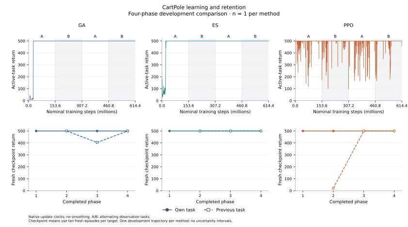

# Continual reinforcement learning with neuroevolution and ShinkaEvolve

## Abstract

We study learning and retention under repeated task changes, with two distinct
objectives: reproducing *Continual Reinforcement Learning with Neuroevolution*
and evaluating ShinkaEvolve as an extension of its genetic algorithm (GA).
Using the pinned reference implementation, we conduct a CartPole development
comparison of GA, evolution strategies (ES), and proximal policy optimization
(PPO), followed by searches over static GA settings and adaptive mutation rules.
The reduced-budget pilot shows a learning–retention trade-off: PPO achieves
higher learning accuracy but greater measured forgetting than GA. A subsequent
four-phase comparison at the reference per-phase budgets gives maximal
phase-end learning accuracy for all three methods. PPO has the largest mean
forgetting and highest cumulative active-task performance in that single
development trial. Static tuning
improves observed active-task return while also increasing mean forgetting.
For the adaptive extension, one rule is selected on development trials and
compared with five fixed controls on a reserved five-seed partition. Its mean
combined active/previous-task score is 0.8423, versus 0.9054 for native FocusGA;
the paired difference is −0.0631 ± 0.0632 (mean ± sample standard deviation).
This comparison does not support an advantage for the selected rule. The study
provides controlled development evidence for the reproduction and extension;
full-budget GA and ES development trials attain maximal phase-end learning
accuracy. Their ten-trial reporting comparison is in progress; the PPO
development comparison is complete over its shorter, resource-limited horizon.

## 1. Introduction

The reproduction asks whether the reference GA, ES, and PPO exhibit the reported
continual-learning behavior when CartPole alternates between tasks. The extension
asks whether program search can improve the GA's response to those changes.
These questions require separate evidence: performance of a searched rule does
not establish reproduction of the reference study, and improvement over an
untuned GA does not establish an advantage over other search methods.

We investigate two extension spaces. First, ShinkaEvolve selects a fixed mutation
width and archive fraction, providing a hyperparameter-search comparison with
random search. Second, it evolves executable rules that adjust mutation width
from training feedback and persistent memory. This permits adaptation during
learning while preserving the GA's policy architecture and selection mechanism.
The principal outcomes are learning, forgetting, and performance on previously
encountered tasks. Search cost and variation across trials are reported alongside
those outcomes.

## 2. Methods

### Reference task and reproduction protocol

The initial reproduction targets the reference cell
`CartPole-v1_sigma0.5`: the original environment alternates with a fixed
observation offset. The learner receives no explicit task-boundary signal.
We preserve the pinned reference policy, task construction, dynamics, and
method-specific evaluation. GA and ES are evaluated through saved centroids;
PPO through its saved policy.

| Protocol component | GA | ES | PPO |
| :--- | ---: | ---: | ---: |
| Distinct tasks / phases | 2 / 20 | 2 / 20 | 2 / 20 |
| Generations or updates per phase | 200 | 200 | 1,500 |
| Total generations or updates | 4,000 | 4,000 | 30,000 |
| Population or parallel environments | 512 | 512 | 2,048 |
| Training episodes per candidate | 3 | 3 | — |
| Rollout steps per PPO update | — | — | 50 |
| Episode cap (steps) | 500 | 500 | 500 |
| Evaluation episodes per checkpoint | 10 | 10 | 10 |
| Nominal training steps per trial | 3.072 × 10⁹ | 3.072 × 10⁹ | 3.072 × 10⁹ |

*Table 1. Original full CartPole reproduction target. GA retains mutation width 0.5 and
archive fraction 0.5; ES retains mutation width 0.1, learning rate 0.05, SGD,
and z-score fitness. PPO retains the reference hyperparameters. The
[reproduction specification](docs/reproduction-plan.md) and
[paper profile](src/shinka_crl/profiles/paper-cartpole.json) define the exact
protocol. The profile explicitly requests 20 phases; the upstream YAML default
of 10 phases is insufficient for this experiment.*

An [amended PPO allocation](docs/reference-comparison.md#ppo-resource-amendment--october-3-2026)
limits its current development experiment to eight hours of active computation,
including evaluation. The [completed prefix](reports/reference-development-ppo-prefix-20261003/summary.json)
contains the first four complete phases (6,000 updates) of the existing
trajectory, retaining the original phase duration and baseline settings.
This shorter horizon supports early acquisition and retention
analysis; twenty-phase PPO behavior and its ten-trial reporting distribution
remain unresolved. GA and ES retain the full reporting protocol in Table 1.

### Partitions and development budgets

Development and validation use task trial `seed + 1`, separating both training
seeds and observation-offset draws from final reporting. The reduced comparative
development trials have four phases and a 500-step episode cap. GA and ES use
population 64 and three training episodes per member. The matched pilot uses
80 GA/ES generations or 600 PPO updates, with 256 PPO environments and 50 rollout
steps per update. These are explicit reductions from Table 1.

| Study partition | Seeds | Task trials | Nominal training steps per trial | Role |
| :--- | :--- | :--- | ---: | :--- |
| Baseline pilot / static search | 1001–1003 | 1002–1004 | 7.68 × 10⁶ | Development |
| Static finalist validation | 2001–2005 | 2002–2006 | 30.72 × 10⁶ | Select one finalist per search arm |
| Adaptive controls / search | 4001–4003 | 4002–4004 | 7.68 × 10⁶ | Development |
| Adaptive finalist validation | 5001–5005 | 5002–5006 | 30.72 × 10⁶ | Evaluate a previously selected rule |
| Full-budget GA/ES development | 1001 | 1002 | 3.072 × 10⁹ | Measure native learning and compute |
| Matched GA/ES/PPO development prefixes | 1001 | 1002 | 614.4 × 10⁶ | Early acquisition and retention; GA/ES reused |
| Final paper reporting | 42–51 | 1–10 | 3.072 × 10⁹ | GA/ES in progress; PPO deferred |

*Table 2. Scientific data partitions. Search uses 20 generations per phase;
both validation studies use 80. Validation therefore changes task draws and
adaptation interval together. Full-budget reference development uses Table 1
and the [reference comparison protocol](docs/reference-comparison.md). The
[GA/ES prefix protocol](reports/reference-development-prefixes-20261003/protocol.json)
and [PPO prefix provenance](reports/reference-development-ppo-prefix-20261003/raw/provenance.json)
define the matched shorter horizon.
Implementation diagnostics use separate reduced
budgets and are excluded from method comparisons. Exact allocations:
[pilot and static search](docs/experimental-roadmap.md),
[static validation](docs/finalist-validation.md),
[adaptive evaluation](docs/adaptive-evaluation.md), and
[frozen adaptive validation](reports/adaptive-validation-freeze-20261003/protocol.md).*

### Measurements

Learning accuracy (LA) averages phase-end performance on the active task.
Signed forgetting (F) averages return on the active task before a switch minus
return on that same task after the following phase. Both switch directions
enter the average, and negative values are retained.
Zero-shot transfer (ZT), LA − F, and cumulative return complement these
measurements. Stationary transfer metrics are undefined. Ten fresh evaluation
episodes per checkpoint supply the post-hoc measurements, following the
reference's method-specific random-key derivation.

The static selection score is mean active-task centroid return across recorded
generations, normalized by episode cap $H=500$:

$$
J_{\mathrm{active}} =
\frac{1}{|S|}\sum_{s \in S}
\frac{1}{T H}\sum_{t=1}^{T}R^{\mathrm{centroid}}_{s,t,a(t)}.
$$

Here $S$ is the seed set, $T$ the number of recorded generations, and $a(t)$ the
active task. Adaptive selection uses a separately frozen objective:

$$
J_{\mathrm{adaptive}} =
\tfrac12 J_{\mathrm{active}}+\tfrac12 J_{\mathrm{previous}},
$$

where $J_{\mathrm{previous}}$ is normalized fresh centroid return on the
preceding task after each switch. It can reflect later acquisition of a
previously weak task and is not a pure measure of retained knowledge. Evaluation
feedback is never an input to a mutation rule.

Unless stated otherwise, dispersion is the sample standard deviation across
seeds, not a confidence interval. Cumulative return uses the reference's
completed-update clock and unit NE-generation integration grid. The first
observed return is extended to step zero; it is not an untrained-policy
measurement. Fixed division by 500 differs from the paper's reference-based
rescaling. Exact definitions and raw episode returns accompany the
[pilot analysis](reports/pilot-20261002/summary.json) and
[adaptive evaluation protocol](docs/adaptive-evaluation.md).

### Static configuration search design

ShinkaEvolve selects a parent program from an evolutionary archive and uses
Codex to propose a mutation. In the static experiment, a candidate returns
literal values for mutation width $\sigma \in [0.001,2.0]$ and archive fraction
$\rho \in [0.05,0.95]$. Random controls sample mutation width log-uniformly
and archive fraction uniformly over those same bounds. Population size, task
schedule, evaluation, and budgets remain fixed. Each candidate trains fresh
policy populations on three development seeds; policy weights are not inherited
between proposals.

The allocation is a shared default plus 24 Shinka proposals, compared with
24 frozen random configurations. The primary comparison matches the number
of distinct proposed configurations; a secondary comparison matches the number
of candidate evaluations, charging repeated training. Before validation, the
top two distinct configurations per arm and the shared default are frozen.
Random finalists are selected from the full random pool. Reserved active-return
means then select one configuration per arm. These validation values therefore
participate in selection and are not final-reporting estimates.
The [search protocol](docs/experimental-roadmap.md) and
[finalist manifest](reports/finalists-static-20261002/manifest.json) specify
the procedure.

### Adaptive mutation programs

The adaptive interface `update_sigma(sigma, stats, memory)` controls the next
generation's mutation width. Its training inputs are normalized batch mean,
standard deviation, maximum fitness, mean current archive fitness, and the
fraction of offspring exceeding the median current archive fitness. Four
persistent memory values carry information between updates. Programs receive
no task identity, switch signal, or post-hoc evaluation results. A restricted
grammar and width bounds of [0.001, 2.0] constrain the search. Rules start at
width 0.5 with archive fraction 0.5 and zero memory. Selection, policy
architecture, random stream, and training budget retain the baseline definitions.
The [program specification](docs/adaptive-programs.md) defines the inputs,
allowed operations, and update timing.

Controls are the identity rule, a fixed arithmetic update, native FocusGA,
and the two static-validation winners. The arithmetic rule applies
`sigma * exp(0.1 * (stats[4] - 0.5))`.
FocusGA also adapts parent selection and retains fixed-width explorers;
it is a whole-method comparator, not an isolated mutation-width ablation.
All control settings are fixed before adaptive search.

The adaptive allocation contains 25 slots, including identity. Repeated or
invalid proposals consume slots; only complete, verified identical evaluations
can be reused. The finalist is the valid program with the highest exact mean
development score, with earlier generation breaking an exact tie.
The [frozen handoff](reports/adaptive-validation-freeze-20261003/plan.json)
records that selection and all five controls before reserved outcomes.
The primary validation comparison is the paired selected-minus-FocusGA
difference in $J_{\mathrm{adaptive}}$; comparisons with the remaining controls
are secondary. No validation feedback is used for further proposals.

## 3. Results

### Matched development pilot

The stationary and alternating-task pilot completed all three methods on three
seeds per condition. Every stationary trial exceeded the predefined final-phase
return threshold of 400, supporting use of this reduced budget for development.


*Figure 1. Individual trials and three-seed means at matched nominal training
steps. Shaded phases introduce the observation offset. Curves are unsmoothed.
[PDF](figures/pilot-20261002.pdf) ·
[Values and provenance](figures/pilot-20261002.json).*

| Condition | Method | LA ↑ | F ↓ | LA − F ↑ | ZT ↑ | Cum. / (steps × 500) ↑ |
| :--- | :--- | ---: | ---: | ---: | ---: | ---: |
| Stationary | GA | 315.2 ± 77.7 | — | — | — | 0.506 ± 0.176 |
| Stationary | ES | 448.4 ± 51.5 | — | — | — | 0.745 ± 0.135 |
| Stationary | PPO | 476.3 ± 41.0 | — | — | — | 0.964 ± 0.002 |
| Switching | GA | 321.0 ± 82.3 | −9.3 ± 62.6 | 330.3 ± 119.1 | 166.2 ± 89.8 | 0.561 ± 0.114 |
| Switching | ES | 407.3 ± 35.5 | 127.8 ± 127.5 | 279.5 ± 147.6 | 137.7 ± 109.0 | 0.604 ± 0.154 |
| Switching | PPO | 481.2 ± 18.0 | 360.0 ± 156.7 | 121.2 ± 140.4 | 104.4 ± 122.6 | 0.908 ± 0.045 |

*Table 3. Development means ± sample SD across three seeds. LA, F, LA − F,
and ZT use CartPole return units; normalized cumulative return is dimensionless.
LA averages all phase endpoints, not just final performance.
[Protocol](docs/experimental-roadmap.md#2-matched-baseline-pilot) ·
[Complete trial evidence](reports/pilot-20261002/summary.json).*

PPO has the highest observed switching learning accuracy and cumulative return,
alongside the largest forgetting. GA's lower forgetting accompanies lower
learning accuracy, so retention alone does not rank the methods. Negative
forgetting can result from improvement on a previously weak task; it does not
imply an absence of later losses.

### Full-budget reference development

GA and ES each completed the full Table 1 budget on development seed 1001 /
task trial 1002. Both attained maximal active-task return at every phase
endpoint. ES also attained return 500 on every fresh previous-task evaluation;
GA showed losses at several switches despite maximal active-task learning.

| Method | LA ↑ | F ↓ | LA − F ↑ | ZT ↑ | Cum. / (steps × 500) ↑ |
| :--- | ---: | ---: | ---: | ---: | ---: |
| GA | 500.00 | 28.39 | 471.61 | 463.77 | 0.9914 |
| ES | 500.00 | 0.00 | 500.00 | 500.00 | 0.9939 |

*Table 4. Full-budget development results, one trial per method. LA, F,
LA − F, and ZT are in CartPole return units; normalized cumulative return is
dimensionless. There is no estimate of between-trial dispersion.
[Exact protocol](docs/reference-comparison.md) ·
[GA evidence](reports/reference-timing-20261002/summary.json) ·
[ES evidence](reports/reference-development-es-20261003/summary.json).*

Native training took 1,811.7 s for GA and 1,375.2 s for ES, with trainer peak
resident memory of 843.2 and 806.4 MiB, respectively, on the two-CPU allocation.
These measured durations include compilation, in-loop evaluation, and checkpoint
writes; post-hoc evaluation is additional work. The linked trial records retain
all phase returns, training curves, compute measurements, and checkpoint hashes.
These development observations cannot establish a method ranking or substitute
for repeated reporting trials, and their longer budgets preclude a direct
comparison with Table 3.

### Four-phase comparison with reference per-phase budgets

The completed PPO development trajectory covers four alternating phases at
the reference per-phase budget. We compare it with the first four phases of
the completed GA and ES trials, reusing their existing training curves and
fresh checkpoint evaluations. Each method therefore contributes one matched
trajectory with the same task draw and 614.4 million nominal training steps.
PPO's saved policies were evaluated in 100 fresh episodes, with no additional
training during finalization. The [PPO evidence](reports/reference-development-ppo-prefix-20261003/summary.json)
and [GA/ES derivation](reports/reference-development-prefixes-20261003/summary.json)
record those identities and budgets.



*Figure 2. Unsmoothed active-task returns on native update clocks (top) and
fresh own-task and previous-task checkpoint returns (bottom). Each method has
one development trajectory. The matched horizon preserves the original phase
duration; it does not represent the full twenty-phase comparison.
[PDF](reports/figures/reference-development-prefixes-20261003.pdf) ·
[Metric figure](reports/figures/reference-development-prefixes-20261003-metrics.svg) ·
[Exact inputs and values](reports/figures/reference-development-prefixes-20261003.json).*

| Method | LA ↑ | F ↓ | LA − F ↑ | ZT ↑ | Cum. / (steps × 500) ↑ |
| :--- | ---: | ---: | ---: | ---: | ---: |
| GA | 500.00 | 32.07 | 467.93 | 468.00 | 0.9571 |
| ES | 500.00 | 0.00 | 500.00 | 500.00 | 0.9697 |
| PPO | 500.00 | 159.67 | 340.33 | 217.43 | 0.9832 |

*Table 5. Matched four-phase development results, one trial per method.
LA, F, LA − F, and ZT are in CartPole return units; normalized cumulative
return is dimensionless. Forgetting and transfer average three switches.
There is no estimate of between-trial dispersion.
[Exact prefix protocol](reports/reference-development-prefixes-20261003/protocol.json) ·
[PPO protocol and provenance](reports/reference-development-ppo-prefix-20261003/raw/provenance.json) ·
[GA/ES evidence](reports/reference-development-prefixes-20261003/summary.json) ·
[PPO evidence](reports/reference-development-ppo-prefix-20261003/summary.json).*

All three methods reach return 500 on their active task at every phase end.
PPO's previous-task return after the first switch is 21, a loss of 479 return
units; at the next two phase endpoints, both its own-task and previous-task
returns are 500. Its mean forgetting is therefore dominated by the first
switch. The [dense PPO curve](reports/reference-development-ppo-prefix-20261003/raw/training/training_metrics.json)
also contains transient retention losses within phases. GA loses 96.2 return
units at one of the three switches; ES has no
measured phase-end loss. These are observations from the
[fresh PPO episodes](reports/reference-development-ppo-prefix-20261003/raw/analysis/evaluation.json)
and [GA/ES phase evaluations](reports/reference-development-prefixes-20261003/summary.json).

PPO has the highest cumulative active-task performance in this seed despite
its greater mean forgetting. Thus high integrated performance on the current
task can coexist with a substantial loss on the previous task. The result
does not establish algorithmic superiority. It also differs from the reduced
pilot's learning-accuracy ordering: at the reference per-phase budgets,
phase-end learning accuracy is tied (Tables 3 and 5).

The [accounted PPO cost](reports/reference-development-ppo-prefix-20261003/summary.json)
is 22,340.0 s (6.206 h), including training, verification, and fresh evaluation,
within the eight-hour allocation. Native training accounts for 22,197.3 s.
GA and ES prefix analysis reused existing evidence; their complete source-run
costs remain recorded above and in Table 11.

### Static configuration search

The completed search contains 25 Shinka evaluations including the shared
default, and 24 additional random evaluations. The Shinka proposals comprise
17 distinct mutations and seven repeated evaluations, with all training charged.


*Figure 3. Best observed development score versus distinct configurations (A)
and candidate evaluations (B). Both arms share the default. The first 17 random
configurations define the primary matched-distinct comparison; all 24 define
the secondary matched-evaluation comparison.
[PDF](figures/search-endpoint-20261002.pdf) ·
[Exact values](figures/search-endpoint-20261002.json).*

| Configuration | Mutation width, σ | Archive fraction | Active score ↑ |
| :--- | ---: | ---: | ---: |
| Shared default | 0.500000 | 0.500000 | 0.5654 ± 0.1168 |
| Best Shinka: program 12 | 0.080000 | 0.075000 | 0.8721 ± 0.0578 |
| Best random: first 17 controls | 0.330187 | 0.062208 | 0.8857 ± 0.0275 |
| Best random: all 24 controls | 0.330187 | 0.062208 | 0.8857 ± 0.0275 |

*Table 6. Selected development maxima, mean ± sample SD across three seeds.
Parameters are rounded. These are search-selection outcomes.
[Protocol](docs/experimental-roadmap.md) ·
[All candidates and exact settings](reports/search-endpoint-20261002/summary.json).*

Random search has the higher observed maximum in both comparisons. One search
per arm cannot establish a general ranking of search methods. Repeated Shinka
proposals also reduce the distinct configurations explored for the same number
of evaluations.

### Reserved static-finalist validation

The five frozen configurations were evaluated on seeds 2001–2005.
These trials use new task draws and longer phases than search.


*Figure 4. Individual reserved outcomes and signed switch differences.
Positive forgetting denotes lost return; negative values denote improvement.
[PDF](figures/validation-static-20261002.pdf) ·
[Values and provenance](figures/validation-static-20261002.json).*

| Configuration | Active score ↑ | LA ↑ | F ↓ | LA − F ↑ | ZT ↑ |
| :--- | ---: | ---: | ---: | ---: | ---: |
| Default GA | 0.7720 ± 0.1846 | 475.8 ± 45.5 | 312.7 ± 174.3 | 163.1 ± 188.7 | 180.7 ± 232.6 |
| Shinka 12 | 0.8894 ± 0.1228 | 487.1 ± 28.7 | 340.2 ± 142.8 | 147.0 ± 152.0 | 141.2 ± 154.8 |
| Shinka 11 | 0.9268 ± 0.0401 | 496.0 ± 9.0 | 353.4 ± 153.8 | 142.6 ± 157.5 | 128.5 ± 141.6 |
| Random 7 | 0.8751 ± 0.1914 | 457.1 ± 95.8 | 340.3 ± 108.8 | 116.9 ± 134.2 | 118.6 ± 120.2 |
| Random 24 | 0.9306 ± 0.0716 | 496.2 ± 8.6 | 441.9 ± 65.4 | 54.3 ± 67.6 | 62.6 ± 74.5 |

*Table 7. Mean ± sample SD across five seeds. Active score is normalized by
500; other columns use return units. The active score alone selects the
winner within each search arm.
[Protocol](docs/finalist-validation.md) ·
[All trials, cumulative metrics, and selected sources](reports/validation-static-20261002/summary.json).*

The declared criterion selects Shinka 11 and random 24. Both have higher mean
active return and higher mean forgetting than the default. Thus static tuning
improves the selection objective without demonstrating improved retention.
Shinka 11 uses $\sigma=0.065$, $\rho=0.075$; random 24 uses approximately
$\sigma=0.224195$, $\rho=0.092160$. Their exact frozen settings carry forward
as adaptive-study controls. These selection-used validation results are
separate from untouched final reporting.

### Adaptive search and fixed controls

The completed adaptive search contains 21 distinct valid programs, including
identity, within its 25-slot allocation. Three grammar rejections and one
interrupted request retain their consumed slots and are excluded from score
rankings; missing evaluations are not assigned zero scientific scores.
The [complete archive](reports/adaptive-endpoint-complete-20261003/summary.json)
retains every proposal and outcome.

| Condition | Combined score ↑ | Active ↑ | Previous ↑ | LA ↑ | F ↓ |
| :--- | ---: | ---: | ---: | ---: | ---: |
| Selected adaptive 5 | 0.4871 ± 0.4047 | 0.6243 | 0.3500 | 479.4 | 312.1 |
| Identity GA | 0.1706 ± 0.1503 | 0.1490 | 0.1922 | 135.0 | 32.1 |
| Arithmetic update | 0.3490 ± 0.4034 | 0.3508 | 0.3471 | 285.4 | 76.9 |
| Native FocusGA | 0.5006 ± 0.2337 | 0.7621 | 0.2390 | 473.7 | 345.5 |
| Static Shinka 11 | 0.4566 ± 0.1457 | 0.7540 | 0.1592 | 493.4 | 411.6 |
| Static random 24 | 0.3643 ± 0.1009 | 0.6540 | 0.0745 | 457.3 | 442.6 |

*Table 8. Adaptive development means across seeds 4001–4003; combined score
also shows sample SD. Active, previous, and combined scores are normalized
by 500; LA and F use return units. The selected row is the maximum over valid
search programs, while control recipes were fixed beforehand.
[Protocol](docs/adaptive-evaluation.md) ·
[Search outcomes](reports/adaptive-endpoint-complete-20261003/summary.json) ·
[Control outcomes](reports/adaptive-controls-20261003/summary.json).*

Generation 5 has the highest combined development mean among searched
programs, exceeding identity but remaining below FocusGA. Its
[frozen source](reports/adaptive-validation-freeze-20261003/programs/selected.py)
smooths mutation width in log space toward a target determined by fitness,
recent progress, fitness spread, archive-fitness changes, and offspring success.
Persistent memory summarizes earlier feedback. This describes the program;
no ablation establishes which terms contribute to its performance.

The selected rule's combined scores are 0.9530, 0.2222, and 0.2863 across the
three development seeds. Its previous-task scores are 1.0000, 0.0226, and
0.0273, respectively
([per-seed evidence](reports/adaptive-endpoint-complete-20261003/summary.json)).
The aggregate therefore conceals weak previous-task performance on two task
draws. Selection uses the combined mean as declared,
without substituting a different criterion after inspecting this variation.

### Reserved adaptive finalist validation

The development-selected rule and all five controls completed the frozen
comparison on seeds 5001–5005. All conditions trained fresh populations;
candidate membership, objective, and control settings were fixed before
reserved outcomes.


*Figure 5. Five outcomes per condition and the primary paired
selected-minus-FocusGA comparison. Error bars show sample SD, not confidence
intervals. Matching task draws does not imply identical internal random draws
across methods.
[PDF](figures/adaptive-validation-20261003.pdf) ·
[Exact values and provenance](figures/adaptive-validation-20261003.json).*

| Condition | Combined score ↑ | Active ↑ | Previous ↑ | LA ↑ | F ↓ |
| :--- | ---: | ---: | ---: | ---: | ---: |
| Selected adaptive 5 | 0.8423 ± 0.2084 | 0.9388 | 0.7459 | 500.0 | 127.1 |
| Identity GA | 0.8681 ± 0.1166 | 0.8553 | 0.8810 | 500.0 | 59.5 |
| Arithmetic update | 0.9025 ± 0.1243 | 0.8518 | 0.9531 | 465.7 | −4.1 |
| Native FocusGA | 0.9054 ± 0.1605 | 0.9498 | 0.8610 | 500.0 | 69.5 |
| Static Shinka 11 | 0.7576 ± 0.1781 | 0.9564 | 0.5588 | 500.0 | 220.6 |
| Static random 24 | 0.7877 ± 0.1564 | 0.9700 | 0.6054 | 500.0 | 197.3 |

*Table 9. Reserved five-seed means; combined score also shows sample SD.
Units follow Table 8. Full per-seed components, continual-learning metrics,
and raw episode returns are retained in the
[complete evidence](reports/adaptive-validation-complete-20261003/summary.json).
[Exact frozen protocol](reports/adaptive-validation-freeze-20261003/protocol.md).*

| Seed | Selected score | FocusGA score | Selected − FocusGA |
| ---: | ---: | ---: | ---: |
| 5001 | 0.482253 | 0.618719 | −0.136466 |
| 5002 | 0.975437 | 0.975379 | +0.000058 |
| 5003 | 0.845436 | 0.963812 | −0.118376 |
| 5004 | 0.928069 | 0.984939 | −0.056871 |
| 5005 | 0.980390 | 0.984140 | −0.003750 |

*Table 10. Primary paired differences in normalized combined-score units.
Mean ± sample SD: −0.0631 ± 0.0632. No significance test or promotion
threshold was prespecified.
[Protocol](reports/adaptive-validation-freeze-20261003/protocol.md) ·
[Exact paired values](reports/adaptive-validation-complete-20261003/summary.json).*

The selected rule scores lower than FocusGA on four of five seeds and has
lower mean active and previous-task performance, with greater mean forgetting.
The primary comparison does not support an advantage for the selected rule.

The prespecified secondary paired differences are −0.0258 ± 0.1096 against
identity, −0.0602 ± 0.0948 against arithmetic, +0.0847 ± 0.0796 against static
Shinka 11, and +0.0546 ± 0.0959 against static random 24.
Thus the selected rule exceeds the static tuned controls on this objective,
but does not exceed the simpler arithmetic adaptation or identity in mean
combined score. All directions are retained in the
[paired analysis](reports/adaptive-validation-complete-20261003/summary.json).
The result does not reopen the search or automatically promote any rule
to final reporting.

### Computational budget

| Experiment | New training trials | Nominal training steps |
| :--- | ---: | ---: |
| Matched baseline pilot | 18 | 138.24 × 10⁶ |
| Static search, both arms | 147 | 1,128.96 × 10⁶ |
| Static finalist validation | 25 | 768.00 × 10⁶ |
| Full-budget GA/ES development reference | 2 | 6,144.00 × 10⁶ |
| Four-phase PPO development prefix | 1 | 614.40 × 10⁶ |
| Adaptive fixed controls | 15 | 115.20 × 10⁶ |
| Adaptive program search | 60 | 460.80 × 10⁶ |
| Adaptive finalist validation | 30 | 921.60 × 10⁶ |

*Table 11. Training allocation consumed by the scientific experiments.
GA/ES counts use the episode cap and are nominal, not realized episode lengths.
In-loop and post-hoc evaluation are additional work. Repeated static evaluations
are charged; adaptive identity reuse is counted once in the fixed controls.
The PPO row records the retained trajectory; its full elapsed training cost is
preserved in the evidence. GA/ES prefix reuse adds no training trials or steps.
These rows exclude implementation diagnostics and incomplete setup work, whose
costs remain in the supplementary evidence. Sources and exact protocols:
[pilot](reports/pilot-20261002/summary.json),
[static search](reports/search-endpoint-20261002/summary.json),
[static validation](reports/validation-static-20261002/summary.json),
[GA reference](reports/reference-timing-20261002/summary.json),
[ES reference](reports/reference-development-es-20261003/summary.json),
[PPO prefix](reports/reference-development-ppo-prefix-20261003/summary.json),
[adaptive controls](reports/adaptive-controls-20261003/summary.json),
[adaptive search](reports/adaptive-endpoint-complete-20261003/summary.json),
[adaptive validation](reports/adaptive-validation-complete-20261003/summary.json).*

Static search obtained 24 model responses; adaptive search obtained 23, with
one additional request interrupted before model execution. Proposals used
GPT-6.1 Sol at medium reasoning effort through Shinka's Codex provider.
Prompts, responses, ancestry, usage, and evaluation costs are preserved in
the linked search archives. Adaptive search additionally used 18,000 fresh
checkpoint-evaluation episodes, and its reserved comparison used 9,000.
[Supplementary setup evidence](reports/search-setup-interrupted-20261002/summary.json)
and [implementation diagnostics](reports/adaptive-gate-20261003/summary.json)
remain separate from the scientific comparisons.

## 4. Discussion and limitations

The observations distinguish acquisition from retention. In the baseline pilot,
high learning accuracy accompanies substantial forgetting. Static tuning
improves active return but does not resolve that trade-off. The adaptive
objective explicitly includes previous-task performance, yet its
development-selected rule does not outperform FocusGA in the reserved
comparison. These negative and mixed outcomes constrain the extension's claims.

At the reference per-phase budgets, all methods achieve maximal endpoint
learning accuracy in the matched four-phase development comparison. ES has
less measured forgetting than GA or PPO, consistent with the direction of the
[pre-specified reference comparison](docs/reference-comparison.md#reference-findings-to-assess).
PPO loses previous-task performance after the first switch but retains both
tasks at the last two phase endpoints. Its higher cumulative active-task
return in this seed therefore does not imply better retention. These
observations support an early learning–retention comparison; repeated-trial
method ordering and twenty-phase PPO behavior remain unresolved.

The experiments use one outer search per search arm and small seed sets.
Selected development maxima are subject to selection bias; static finalist
validation also participates in selection. The adaptive reserved comparison
evaluates a previously fixed rule, but changes both task draws and phase
length. Its higher scores than development cannot be interpreted as a matched
improvement. Repeated outer searches and appropriate search controls are
required for claims about ShinkaEvolve as a search method.

The adaptive search resumed from an earlier saved random-number state after
an interruption. Its archive represents the recorded multi-session search,
rather than an uninterrupted sampling trajectory. The
[declared sampling deviation](reports/adaptive-recovery-preflight-20261003/recovery-plan.json)
and [complete endpoint](reports/adaptive-endpoint-complete-20261003/summary.json)
preserve that distinction; the evaluator, grammar, controls, and allocation
remained fixed, and consumed slots were not replaced.

The reproduction remains incomplete. The pilot and extension studies use
reduced populations and shorter task sequences; the reported normalization
differs from the paper. Final reporting seeds 42–51 and task trials 1–10
were reserved independently of development and selection.
The [reference comparison](docs/reference-comparison.md) uses unchanged baseline
settings. Full-budget GA/ES development observations are available, and their
reporting trials are in progress. The completed PPO prefix supplies an
early-phase development analysis, leaving the full three-method reproduction
incomplete.
Broader reproduction also requires the other environments, task variations,
continual PPO variants, and neighborhood analysis in the
[reproduction plan](docs/reproduction-plan.md).
The [experimental roadmap](docs/experimental-roadmap.md) separates that work
from further development of the ShinkaEvolve extension.

## 5. Reproducibility

Reference sources are pinned and preserved unchanged. Integration, candidate
interfaces, analysis, and experiment runners live in this repository.

| Component | Pinned source |
| :--- | :--- |
| Reference trainer | [821570eb6a22](https://github.com/eleninisioti/continual_neuroevolution/tree/821570eb6a22db0f7aa77111b2ea541fe8fa795b) |
| ShinkaEvolve | [9912af12d423](https://github.com/SakanaAI/ShinkaEvolve/tree/9912af12d423504b8d580f4179fd15f5f88b8c50) |
| Reference paper | [arXiv:2610.01583v1](https://arxiv.org/abs/2610.01583v1) |

*Table 12. Pinned reference sources. Full revisions and dependency declarations
are retained in the [source lock](upstream.lock.json).*

The [source lock](upstream.lock.json) and per-experiment manifests record exact
versions, configurations, seeds, candidate sources, and hashes. The CartPole
experiments use the hash-locked CPU subset of the reference environment,
including JAX 0.5.3, separately from the Shinka environment. This environment
difference is documented in the [reproduction specification](docs/reproduction-plan.md).

```bash
git clone https://github.com/ReloadLightly/shinka-continual-reinforcement-learning.git
cd shinka-continual-reinforcement-learning
uv sync --frozen --group dev
uv run --frozen python scripts/bootstrap_upstream.py
uv run --frozen python scripts/bootstrap_cpu.py
uv run --frozen pytest
uv run --frozen ruff check .

# Preview the full GA reporting protocol without starting training.
uv run --frozen python scripts/run_baseline.py --profile paper-cartpole --method ga
```

Detailed execution and replay instructions accompany the
[static search](tasks/cartpole_ga/README.md),
[static validation and full-budget reference](docs/finalist-validation.md),
[adaptive evaluation](docs/adaptive-evaluation.md),
[adaptive search](docs/adaptive-search.md), and
[adaptive validation](docs/adaptive-validation.md).
Use each experiment's recorded source revision when replaying a frozen
implementation and fresh output paths for new runs. Raw metrics, episode
returns, failed attempts, protocol deviations, and artifact hashes remain
in the linked evidence archives; large binary checkpoints remain outside Git.
Existing reports are historical records, not rewritten to match later results.

Implementation checks establish the conditions for interpreting the experiments:
the [identity adapter](reports/adaptive-gate-20261003/summary.json) matches native
GA across a task switch, and
[reserved-trial verification](reports/adaptive-validation-outcome-review-20261003.json)
independently reconstructs scores and paired differences from raw evidence.
These checks are distinct from evidence of learning performance.

## References

**[1]** Eleni Nisioti, Andrea Cossu, Kathrin Korte, and Sebastian Risi.
*Continual Reinforcement Learning with Neuroevolution*. arXiv:2610.01583v1, 2026.
[Paper](https://arxiv.org/abs/2610.01583v1) ·
[Reference implementation](https://github.com/eleninisioti/continual_neuroevolution).

**[2]** Sakana AI. *ShinkaEvolve*.
[Documentation](https://sakanaai.github.io/ShinkaEvolve/) ·
[Source](https://github.com/SakanaAI/ShinkaEvolve).
